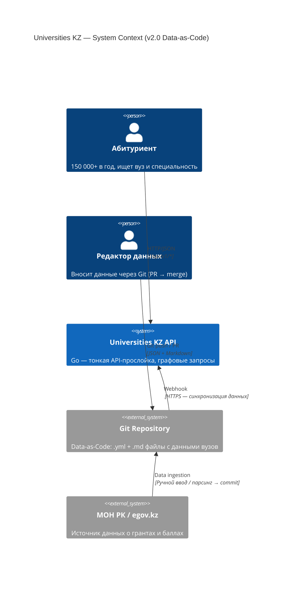
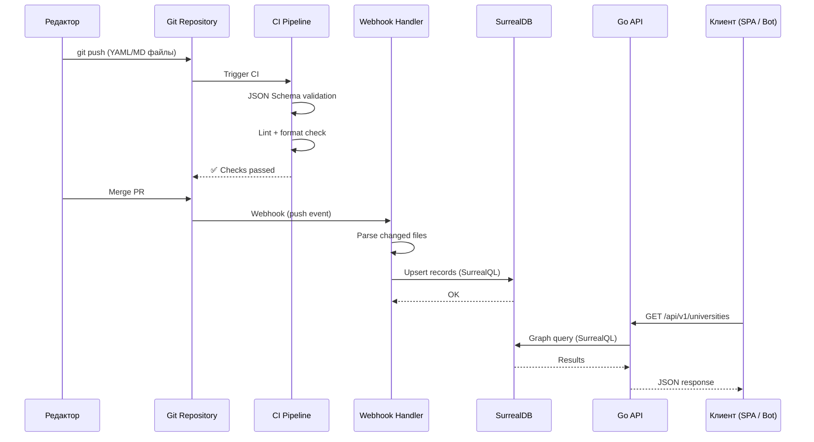

# 1. Executive Summary

## 1.1 Проблема

В Казахстане ежегодно более **150 000 абитуриентов** проходят процедуру выбора вуза и специальности. Существующие информационные ресурсы страдают от двух системных проблем:

1. **Информационный хаос.** Данные о проходных баллах ЕНТ, грантах, сельских квотах и профильных предметах разбросаны по PDF-отчётам МОН РК, сайтам вузов и неофициальным агрегаторам. Единого структурированного источника с актуальными данными не существует.

2. **Неспособность выдерживать пиковые нагрузки.** В период подачи заявок (июль–август) государственные и частные порталы регулярно деградируют или становятся недоступными из-за архитектурных ограничений и отсутствия оптимизации под высокий конкурентный доступ.

## 1.2 Решение

**Universities KZ** — высоконагруженная база знаний (Wiki) для абитуриентов Казахстана, построенная на графовой модели данных. Система агрегирует и структурирует связи между вузами, специальностями, группами образовательных программ и предметами ЕНТ в единую граф-базу.

Архитектура реализует паттерн **Data-as-Code** с двумя разделёнными контурами:

- **Контур данных (Git)** — структурированные `.yml` и `.md` файлы в Git-репозитории. Управление данными через PR → review → merge → webhook. Полная история изменений, аудит, откат — средствами VCS.
- **Контур потребления (API)** — тонкая Go-прослойка между клиентскими приложениями и графовой базой данных. Read-only JSON API с графовыми запросами, полнотекстовым поиском и фильтрацией.

## 1.3 Ключевые архитектурные решения

| Решение                                | Обоснование                                                                                                                                                                                    |
| -------------------------------------- | ---------------------------------------------------------------------------------------------------------------------------------------------------------------------------------------------- |
| **Data-as-Code (Git + YAML/MD)**       | Данные версионируются наравне с кодом. PR-based workflow обеспечивает review, аудит и откат. Отсекает целый класс атак (CSRF, XSS, OAuth hijack), радикально упрощая поверхность безопасности. |
| **GitOps (webhook → SurrealDB)**       | Изменения в Git-репозитории автоматически синхронизируются с базой данных через webhook-пайплайн. Единый источник истины — Git, БД — производный кэш для быстрых графовых запросов.            |
| **Go + Fiber (тонкая API-прослойка)**  | Бэкенд отвечает только за роутинг и обход графов. Минимальный footprint, предсказуемая производительность. Один бинарник — деплой копированием файла.                                          |
| **SurrealDB (graph + document + FTS)** | Графовая модель устраняет `JOIN`-цепочки при обходе связей «Вуз → Специальность → Группа ОП → Предметы ЕНТ». Встроенный полнотекстовый поиск (BM25) исключает зависимость от Elasticsearch.    |
| **MinIO**                              | Self-hosted S3-совместимое хранилище для медиафайлов. Бэкенд выступает прокси — валидирует, загружает, отдаёт публичные URL.                                                                   |
| **Отказ от веб-админки**               | Устранение HTMX-панели, OAuth, сессий и cookie-auth убирает ~30 handler-ов, auth-middleware, SSR-шаблоны и Tailwind-пайплайн. Оптимизирует затраты мощностей и отсекает основные вектора атак. |

## 1.4 Преимущества перед предыдущей архитектурой (v1.0)

| Аспект                    | v1.0 (монолит + HTMX-админка)                   | v2.0 (тонкий API + Data-as-Code)                      |
| ------------------------- | ----------------------------------------------- | ----------------------------------------------------- |
| **Управление данными**    | Веб-админка (HTMX + SSR + Google OAuth)         | Git-репозиторий (YAML/MD + webhook)                   |
| **Аутентификация**        | Google OAuth 2.0 + cookie session               | Не требуется (Git auth на уровне VCS)                 |
| **Роль бэкенда**          | API + SSR-рендеринг + CRUD + auth               | Тонкая API-прослойка + графовые запросы               |
| **Поверхность атаки**     | CSRF, XSS, OAuth, session, CSS injection        | Только SurrealQL injection (защищено параметризацией) |
| **Затраты мощностей**     | SSR + шаблоны + Tailwind + auth middleware      | Только API-ответы (JSON)                              |
| **Аудит изменений**       | Логи в приложении (теряются при рестарте)       | Полная история в `git log` (навсегда)                 |
| **Фронтенд-зависимости**  | Tailwind CSS, htmx.min.js, Node.js              | Отсутствуют                                           |
| **Количество admin-кода** | ~30 handlers + auth + views + renderer          | 0 (удалено)                                           |
| **Скорость onboarding**   | Нужно поднять OAuth, создать `.env` с секретами | `git clone` + `docker compose up`                     |

## 1.5 Текущий статус

Система находится в стадии **active development** после архитектурного рефакторинга (v1.0 → v2.0). Реализованы и функционируют:

- Полная схема данных (5 таблиц + 2 edge-таблицы) с SCHEMAFULL-валидацией и полнотекстовыми индексами.
- Repository-слой с CRUD-операциями и графовыми запросами для всех сущностей.
- REST API (`/api/v1`) — 8 read-only эндпоинтов с фильтрацией и пагинацией.
- Загрузка и валидация медиафайлов через MinIO.
- CI pipeline (GitHub Actions): build, test, lint, docker validate.
- YAML-шаблоны для Data-as-Code (`university.yml`, `specialty.yml`, `specialty_group.yml`).

**Удалено в рамках рефакторинга v2.0:**

- Веб-админка (HTMX + SSR, ~30 admin handlers, renderer, views, partials).
- Аутентификация (Google OAuth 2.0, session store, auth middleware, build tags `noauth`).
- Фронтенд-пайплайн (Tailwind CSS, Node.js, `package.yml`, `tailwind.config.js`).

**Ближайшие приоритеты:**

- GitOps pipeline: webhook → JSON Schema валидация → синхронизация с SurrealDB.
- CORS-конфигурация для публичных клиентов.
- Rate limiting на `/api/v1/*`.
- Публичный фронтенд (React SPA / Next.js).

## 1.6 Диаграмма контекста системы

## 1.7 Поток данных (Data-as-Code)

---

_Следующий раздел: [Architectural Vision →](./02-architectural-vision.md)_
