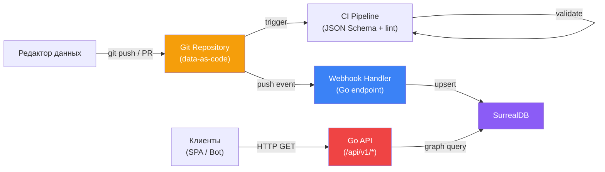
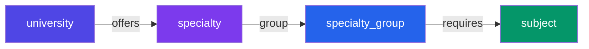
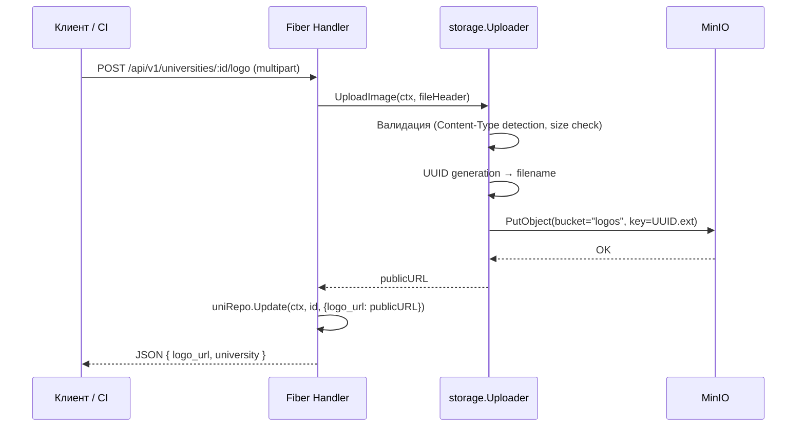
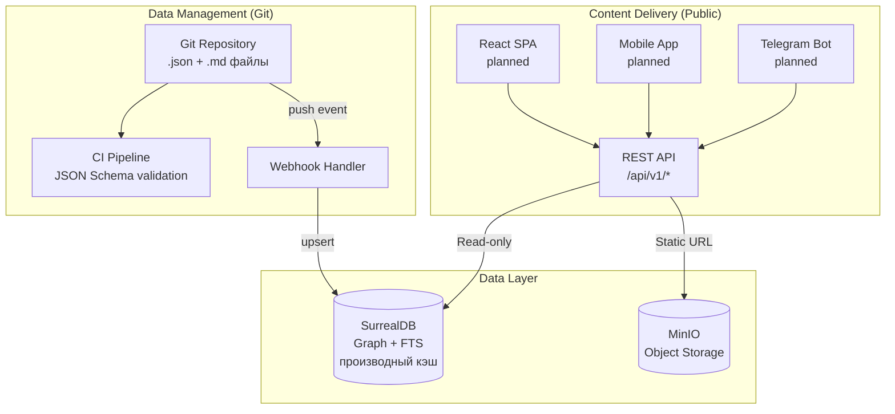
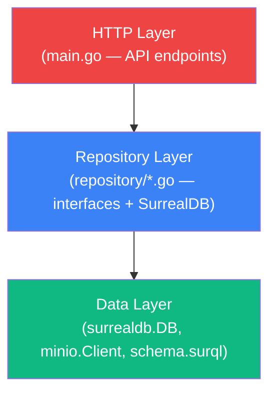
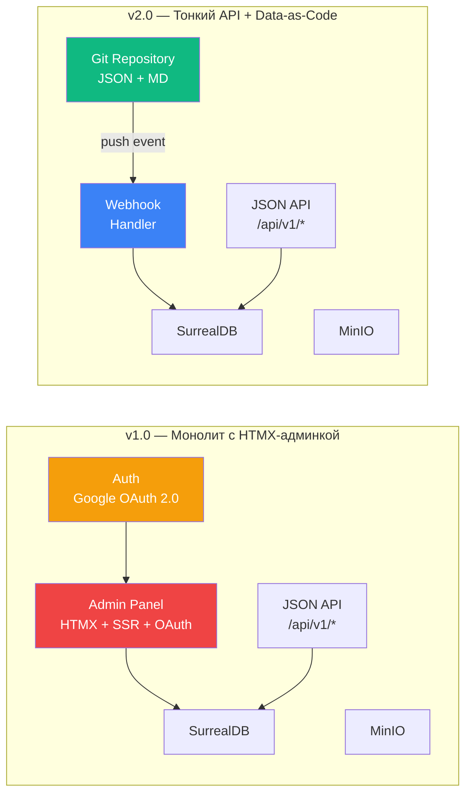

# 2. Architectural Vision

## 2.1 Принципы проектирования

Архитектура Universities KZ строится на шести принципах, каждый из которых продиктован конкретными условиями эксплуатации:

| #   | Принцип                         | Мотивация                                                                                                                                                                                       |
| --- | ------------------------------- | ----------------------------------------------------------------------------------------------------------------------------------------------------------------------------------------------- |
| 1   | **Data-as-Code**                | Данные о вузах — это контент, который редко меняется и требует аудита. Git обеспечивает версионирование, review, откат и полную историю изменений без написания собственной системы управления. |
| 2   | **Minimal attack surface**      | Каждый endpoint — потенциальный вектор атаки. Устранение веб-админки, OAuth, сессий и cookie-auth отсекает целый класс уязвимостей (CSRF, XSS, session hijacking, OAuth abuse).                 |
| 3   | **Thin API layer**              | Бэкенд не содержит бизнес-логики управления данными — он лишь маршрутизирует запросы и обходит граф. Чем меньше кода, тем меньше багов и тем проще аудит.                                       |
| 4   | **Graph-first data model**      | Предметная область (вуз → специальность → группа ОП → предметы ЕНТ) — это граф. Реляционная модель потребовала бы 4+ JOIN для типового запроса.                                                 |
| 5   | **Fail-fast initialization**    | Все зависимости (SurrealDB, MinIO) проверяются при старте. Если компонент недоступен — процесс завершается с явной ошибкой, а не деградирует молча.                                             |
| 6   | **Deploy as a single artifact** | Один Go-бинарник + Docker Compose для инфраструктуры. Деплой сводится к `docker compose up`.                                                                                                    |

## 2.2 Выбор технологий

### 2.2.1 Data-as-Code (Git + YAML/MD)

**Это ключевое архитектурное решение v2.0** — замена веб-админки на Git-репозиторий с типовыми файлами данных.

**Почему Data-as-Code:**

| Проблема классической веб-админки                        | Решение через Data-as-Code                                   |
| -------------------------------------------------------- | ------------------------------------------------------------ |
| Нужен OAuth, сессии, CSRF-токены, cookie security        | Аутентификация средствами Git-хостинга (SSH-ключи, PAT, SSO) |
| Вектора атак: XSS, CSRF, session fixation, CSS injection | Полностью отсечены — нет веб-интерфейса управления           |
| Дублирование валидации (формы + бэкенд + БД)             | JSON Schema в CI + SurrealDB SCHEMAFULL                      |
| SSR-рендеринг шаблонов потребляет CPU                    | Бэкенд обслуживает только read-heavy JSON API                |
| История изменений — в логах приложения (теряется)        | `git log` — навсегда, с автором, diff, revert                |
| Откат данных — ручное вмешательство в БД                 | `git revert` → webhook → БД обновлена                        |
| Code review для данных невозможен                        | PR-based workflow: diff → review → approve → merge           |

**Структура данных в Git-репозитории:**

```
data/
├── universities/
│   ├── kaznu.yml           # Данные о КазНУ
│   ├── kaznu.md            # Описание КазНУ (Markdown)
│   ├── sdu.yml
│   ├── sdu.md
│   └── ...
├── specialties/
│   ├── 6B06101.yml         # Информационные системы
│   ├── 6B07201.yml
│   └── ...
├── groups/
│   ├── B057.yml            # ИТ (Математика + Информатика)
│   ├── B058.yml
│   └── ...
└── subjects/
    ├── math.yml
    ├── physics.yml
    └── ...
```

**Типовые YAML-шаблоны:**

Каждый тип данных описан через типовой `.yml` файл со структурой, соответствующей SurrealDB-схеме. Шаблоны определяют контракт: какие поля обязательны, какие типы допустимы, какие связи нужно указать. Валидация проходит в CI через JSON Schema.

- `university.yml` — название (kz/ru/en), аббревиатура, город, тип, сайт, описание, список offers (специальности с грантами и баллами).
- `specialty.yml` — код ОП, название (kz/ru/en), код группы ОП.
- `specialty_group.yml` — код группы, название (kz/ru/en), два профильных предмета ЕНТ.

**Два режима синхронизации:**

1. **Инкрементальный (Push Webhook):** При мерже в `main` GitHub отправляет подписанный (HMAC-SHA256) POST-запрос на бэкенд со списком измененных файлов.
2. **Полный (Startup Tarball Sync):** При запуске (или рестарте контейнера) Go-бэкенд одним запросом скачивает весь репозиторий в виде `.tar.gz` архива, распаковывает его в оперативной памяти и быстро заливает в SurrealDB (эфемерный диск или memory). Это решает проблему холодных стартов на PaaS (например, DigitalOcean App Platform) и экономит rate limits GitHub API.

**GitOps pipeline:**



### 2.2.2 Go + Fiber

**Почему Go:**

- **Предсказуемая производительность.** GC с паузами < 1 мс, отсутствие JIT-прогрева. Latency p99 стабилен от первого запроса.
- **Goroutines.** Конкурентная обработка тысяч соединений без thread-pool tuning. Каждый HTTP-запрос обрабатывается в отдельной горутине — Fiber абстрагирует это через `fasthttp`.
- **Статическая типизация.** Модели данных (`models/university.go`, `models/edge.go`) проверяются на этапе компиляции. Ошибки несовпадения типов между Go-структурами и SurrealDB SCHEMAFULL-полями выявляются до деплоя.
- **Embed.** Миграции (`schema.surql`) вшиваются в бинарник через `embed.FS`. В production деплой — один файл, без зависимости от файловой системы.
- **Минимальный footprint.** Скомпилированный бинарник ~10–15 МБ (без SSR-шаблонов и статики — ещё меньше, чем в v1.0). Потребление RAM под нагрузкой — десятки МБ.

**Почему Fiber (а не `net/http`, Chi, Echo):**

- **fasthttp под капотом.** Zero-allocation routing, переиспользование буферов. На синтетических бенчмарках — 2–3x throughput vs `net/http` для I/O-bound workloads.
- **Built-in middleware.** `compress`, `cors`, `limiter`, `helmet` — всё из коробки без сторонних зависимостей.
- **API близок к Express.js.** Порог входа для новых контрибьюторов минимален.

**Роль Fiber в v2.0:**

В новой архитектуре Fiber используется исключительно как JSON API router. Middleware-стек значительно упрощён по сравнению с v1.0:

| Middleware в v1.0        | Middleware в v2.0       | Статус                             |
| ------------------------ | ----------------------- | ---------------------------------- |
| `compress`               | `compress`              | ✅ Остался                         |
| `session`                | —                       | ❌ Удалён (нет cookie-auth)        |
| `static` (CSS/JS/images) | —                       | ❌ Удалён (нет фронтенд-ассетов)   |
| `auth.AuthRequired`      | —                       | ❌ Удалён (нет админки)            |
| `auth.NoAuthMiddleware`  | —                       | ❌ Удалён (нет build tag `noauth`) |
| —                        | `cors` (планируется)    | 🔲 Новый                           |
| —                        | `limiter` (планируется) | 🔲 Новый                           |
| —                        | `helmet` (планируется)  | 🔲 Новый                           |

Инициализация Fiber из `cmd/api/main.go`:

```cmd/api/main.go#L85-L89
	app := fiber.New(fiber.Config{
		AppName:      "Universities KZ v1.0",
		ReadTimeout:  10 * time.Second,
		WriteTimeout: 10 * time.Second,
	})
```

### 2.2.3 SurrealDB

**Почему графовая база:**

Предметная область Universities KZ — это ориентированный граф с атрибутированными рёбрами:



В реляционной модели запрос «Найти все вузы, которые предлагают специальности, требующие Математику и Физику» потребовал бы:

```/dev/null/relational_query.sql#L1-8
SELECT DISTINCT u.*
FROM universities u
JOIN offers o ON o.university_id = u.id
JOIN specialties s ON s.id = o.specialty_id
JOIN specialty_groups sg ON sg.id = s.group_id
JOIN requires r1 ON r1.group_id = sg.id AND r1.subject_id = (SELECT id FROM subjects WHERE name = 'Математика')
JOIN requires r2 ON r2.group_id = sg.id AND r2.subject_id = (SELECT id FROM subjects WHERE name = 'Физика')
```

В SurrealDB тот же запрос реализован через обратный обход графа (`subject_repo.go`):

```internal/repository/subject_repo.go#L104-L109
	query := `
		LET $group_ids = (SELECT VALUE in FROM requires WHERE out = $subject_id);
		LET $spec_ids  = (SELECT VALUE id FROM specialty WHERE ` + "`group`" + ` IN $group_ids);
		LET $uni_ids   = array::distinct((SELECT VALUE in FROM offers WHERE out IN $spec_ids));
		SELECT * FROM university WHERE id IN $uni_ids ORDER BY name.ru ASC;
	`
```

**Почему SurrealDB заменяет три базы:**

| Функция              | Альтернатива    | SurrealDB                                                                                                                  |
| -------------------- | --------------- | -------------------------------------------------------------------------------------------------------------------------- |
| **Graph traversal**  | Neo4j, ArangoDB | Нативные edge-таблицы с `TYPE RELATION FROM...TO...`. `FETCH out` автоматически разворачивает RecordID в полный объект.    |
| **Document storage** | MongoDB         | Каждая запись — JSON/CBOR-документ. Вложенные объекты (`name.kz`, `name.ru`, `name.en`) хранятся нативно.                  |
| **Full-text search** | Elasticsearch   | Встроенный FTS с кастомным анализатором (`name_analyzer`), BM25-ранжирование, поддержка кириллицы через `edgengram(2,15)`. |

**SCHEMAFULL-режим:**

Все таблицы определены как `SCHEMAFULL` — SurrealDB отвергает записи с полями, не описанными в схеме, и валидирует типы и ASSERT-условия:

```internal/db/schema.surql#L40-L42
DEFINE FIELD OVERWRITE type           ON TABLE university TYPE string
    ASSERT $value IN ["public", "private"];
```

```internal/db/schema.surql#L253-L254
DEFINE FIELD OVERWRITE min_score          ON TABLE offers TYPE int
    ASSERT $value >= 0 AND $value <= 140;
```

Это обеспечивает двойную валидацию:

1. **В CI** — JSON Schema при коммите данных в Git.
2. **В БД** — SurrealDB SCHEMAFULL ASSERT при синхронизации через webhook.

**Роль SurrealDB в Data-as-Code архитектуре:**

SurrealDB выступает как **производный кэш** (derived cache) для графовых запросов. Источником истины является Git-репозиторий. При потере БД её можно полностью восстановить из Git-данных, прогнав webhook-синхронизацию по всем файлам.

### 2.2.4 MinIO

**Роль в архитектуре:**

MinIO выступает как S3-совместимое объектное хранилище для медиафайлов (логотипы вузов, документы). Бэкенд на Go является единственной точкой входа для загрузки файлов.

**Поток загрузки:**



**Бакеты и политики:**

| Бакет       | Политика доступа                            | Назначение                                                  |
| ----------- | ------------------------------------------- | ----------------------------------------------------------- |
| `logos`     | Public READ-ONLY (`s3:GetObject` для `*`)   | Логотипы вузов. URL отдаётся напрямую клиентам.             |
| `documents` | Private (только аутентифицированный бэкенд) | Внутренние документы, лицензии. Доступ через проксирование. |

Политика устанавливается программно при инициализации (`storage.go: setLogosPublicReadPolicy`):

```internal/storage/storage.go#L156-L167
	policy := map[string]any{
		"Version": "2012-10-17",
		"Statement": []map[string]any{
			{
				"Effect":    "Allow",
				"Principal": map[string]any{"AWS": []string{"*"}},
				"Action":    []string{"s3:GetObject"},
				"Resource":  []string{fmt.Sprintf("arn:aws:s3:::%s/*", BucketLogos)},
			},
		},
	}
```

## 2.3 Концепция «Data-as-Code Wiki»

Universities KZ v2.0 спроектирован как **Data-as-Code Wiki** — система, в которой данные управляются как код, а потребляются через API.



**Ключевые свойства модели:**

1. **Git как единый источник истины.** Все данные о вузах, специальностях и группах ОП хранятся в Git-репозитории. SurrealDB — производный кэш для быстрых графовых запросов. При потере БД — полное восстановление из Git.

2. **PR-based workflow.** Изменения данных проходят через Pull Request: diff → review → approve → merge → webhook → БД. Это обеспечивает аудит, rollback и quality control без написания собственного UI.

3. **Независимость фронтенда.** Публичный API не знает о существовании React, мобильного приложения или Telegram-бота. Любой клиент, способный отправить HTTP GET, может потреблять данные.

4. **Минимальная поверхность атаки.** Нет веб-интерфейса управления → нет OAuth, сессий, CSRF, XSS. Аутентификация редакторов — средствами Git-хостинга (GitHub/GitLab SSO, SSH-ключи, PAT).

5. **Декларативное описание данных.** JSON-файлы описывают _что_ должно быть в базе, а не _как_ это туда загрузить. Webhook-handler реализует синхронизацию (upsert / delete).

**Сравнение с предыдущей моделью «Headless Wiki» (v1.0):**

| Аспект                     | v1.0 Headless Wiki                       | v2.0 Data-as-Code Wiki       |
| -------------------------- | ---------------------------------------- | ---------------------------- |
| Создание данных            | Веб-формы (HTMX + SSR)                   | Git commit (JSON/MD файлы)   |
| Аутентификация             | Google OAuth 2.0 + cookie session        | Git auth (SSH / PAT / SSO)   |
| Аудит изменений            | Логи приложения                          | `git log --oneline`          |
| Откат ошибочных данных     | Ручная правка через админку              | `git revert <sha>` → webhook |
| Review изменений           | Нет (кто имеет доступ — меняет напрямую) | PR + review + approve        |
| Количество кода на бэкенде | ~30 admin handlers + auth + renderer     | 0 admin handlers             |
| Фронтенд-зависимости       | Tailwind, HTMX, Node.js                  | Отсутствуют                  |

## 2.4 Слоистая архитектура бэкенда

Бэкенд организован в три слоя с однонаправленной зависимостью (упрощено по сравнению с v1.0 — удалены слои Admin, Auth, Views):



```
┌─────────────────────────────────────────────────────────┐
│  HTTP Layer                                             │
│  cmd/api/main.go          — API endpoints (inline)      │
├─────────────────────────────────────────────────────────┤
│  Repository Layer (interfaces)                          │
│  internal/repository/*     — Go interfaces + SurrealDB  │
│  internal/storage/*        — Uploader interface + MinIO  │
├─────────────────────────────────────────────────────────┤
│  Models Layer                                           │
│  internal/models/*         — Domain structs, enums       │
├─────────────────────────────────────────────────────────┤
│  Data Layer                                             │
│  internal/db/*             — SurrealDB connection,       │
│                              migrations, schema.surql    │
└─────────────────────────────────────────────────────────┘
```

**Правила зависимостей:**

| Слой       | Может зависеть от                | Не может зависеть от     |
| ---------- | -------------------------------- | ------------------------ |
| HTTP       | Repository, Models, Storage      | —                        |
| Repository | Models, `surrealdb.DB`           | HTTP                     |
| Models     | Только `surrealdb.go/pkg/models` | Repository, HTTP         |
| Data       | Только `surrealdb.go`, `embed`   | Models, Repository, HTTP |

**Что удалено по сравнению с v1.0:**

| Слой / пакет v1.0  | Назначение                            | Причина удаления                |
| ------------------ | ------------------------------------- | ------------------------------- |
| `internal/admin/*` | HTMX CRUD handlers, renderer, views   | Заменён на Data-as-Code (Git)   |
| `internal/auth/*`  | Google OAuth 2.0, session, middleware | Не нужен — нет веб-админки      |
| `views/**/*.html`  | Go html/template шаблоны              | Не нужен — нет SSR              |
| `static/css/*`     | Tailwind CSS input/output             | Не нужен — нет фронтенд-ассетов |

**Инверсия зависимостей через интерфейсы:**

Каждый репозиторий определён как интерфейс в том же пакете, где находится его реализация. API-хендлеры зависят от интерфейса, а не от конкретной реализации:

```internal/repository/university_repo.go#L17-L22
type UniversityRepository interface {
	GetAll(ctx context.Context, f models.UniversityFilters) ([]models.University, error)
	GetByID(ctx context.Context, id surrealmodels.RecordID) (*models.University, error)
	GetWithSpecialties(ctx context.Context, id surrealmodels.RecordID) (*models.UniversityDetail, error)
	Create(ctx context.Context, u models.University) (*models.University, error)
	Update(ctx context.Context, id surrealmodels.RecordID, u models.University) (*models.University, error)
```

Это позволяет:

- Подменять реализацию в unit-тестах (mock repository).
- Менять бэкенд хранения (например, SurrealDB → PostgreSQL) без изменения handler-кода.
- Чётко разграничить ответственность: handlers не знают SurrealQL, репозитории не знают HTTP.

> **Примечание:** Методы `Create`, `Update`, `Delete` в репозиториях сохранены для использования webhook-handler'ом (GitOps pipeline), который будет синхронизировать данные из Git в SurrealDB.

## 2.5 Сравнение архитектур: v1.0 → v2.0



| Метрика                | v1.0                                                                | v2.0                                               | Изменение  |
| ---------------------- | ------------------------------------------------------------------- | -------------------------------------------------- | ---------- |
| Go-пакетов             | 7 (`cmd`, `db`, `models`, `repository`, `storage`, `admin`, `auth`) | 5 (`cmd`, `db`, `models`, `repository`, `storage`) | −2         |
| HTTP handlers          | ~40 (8 API + ~30 admin + 4 auth)                                    | 8 (только API)                                     | −80%       |
| Middleware             | 4 (`compress`, `static`, `session`, `auth`)                         | 1 (`compress`)                                     | −75%       |
| Фронтенд-файлов        | ~20 (HTML templates + CSS + JS)                                     | 0                                                  | −100%      |
| npm-зависимости        | 1 (`tailwindcss`)                                                   | 0                                                  | −100%      |
| Вектора атак           | 5+ (CSRF, XSS, OAuth, session, CSS injection)                       | 1 (SurrealQL injection — защищено)                 | −80%       |
| Точка входа для данных | Веб-форма (HTTP POST)                                               | Git commit + webhook                               | Безопаснее |

---

_Предыдущий раздел: [← Executive Summary](./01-executive-summary.md)_
_Следующий раздел: [Data Layer (Deep Dive) →](./03-data-layer.md)_
