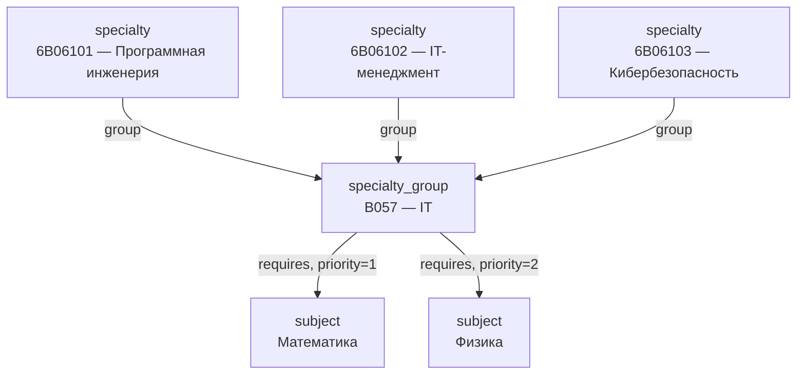
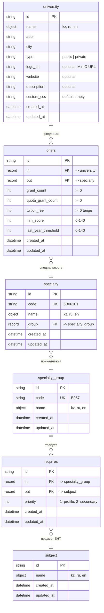

# 3. Data Layer (Deep Dive)

## 3.1 Обзор схемы данных

Схема Universities KZ определена в файле `internal/db/schema.surql` и применяется идемпотентно при каждом старте приложения через `db.RunMigrations()`. Все конструкции `DEFINE` используют модификатор `OVERWRITE` (требование SurrealDB 3.0).

Схема состоит из:

- **5 таблиц** (узлы графа): `university`, `specialty_group`, `specialty`, `subject`, `allowed_admins`
- **2 edge-таблицы** (рёбра графа): `offers`, `requires`
- **1 анализатор** для полнотекстового поиска: `name_analyzer`
- **12 индексов**: 9 полнотекстовых (BM25), 2 уникальных, 1 обычный

Все таблицы работают в режиме `SCHEMAFULL` — SurrealDB отвергает любые поля, не определённые в схеме, и валидирует типы данных и ASSERT-ограничения на уровне движка.

## 3.2 Граф: общая топология


Направление обхода:

| Запрос                                      | Направление                                                                      | SurrealQL                                               |
| ------------------------------------------- | -------------------------------------------------------------------------------- | ------------------------------------------------------- |
| «Какие специальности предлагает вуз X?»     | `university → offers → specialty`                                                | `SELECT * FROM offers WHERE in = $uni_id FETCH out`     |
| «Какие предметы ЕНТ нужны для группы ОП Y?» | `specialty_group → requires → subject`                                           | `SELECT * FROM requires WHERE in = $group_id FETCH out` |
| «Какие вузы принимают с Математикой?»       | `subject ← requires ← specialty_group ← group ← specialty ← offers ← university` | Обратный обход через `LET` + `IN` (см. §3.6)            |

## 3.3 Таблицы (узлы графа)

### 3.3.1 `university` — Вуз

| Поле          | Тип (SurrealQL)  | Тип (Go)                  | Описание                        | Ограничения                              |
| ------------- | ---------------- | ------------------------- | ------------------------------- | ---------------------------------------- |
| `id`          | (auto)           | `*surrealmodels.RecordID` | PK, генерируется SurrealDB      | —                                        |
| `name`        | `object`         | `LocalizedName`           | Название на 3 языках            | —                                        |
| `name.kz`     | `string`         | `string`                  | Казахское название              | —                                        |
| `name.ru`     | `string`         | `string`                  | Русское название                | —                                        |
| `name.en`     | `string`         | `string`                  | Английское название             | —                                        |
| `abbr`        | `string`         | `string`                  | Аббревиатура (МУИТ, КазНУ, SDU) | —                                        |
| `city`        | `string`         | `string`                  | Город расположения              | Индекс `idx_university_city`             |
| `type`        | `string`         | `UniversityType`          | Тип вуза                        | `ASSERT $value IN ["public", "private"]` |
| `logo_url`    | `option<string>` | `*string`                 | URL логотипа в MinIO            | —                                        |
| `website`     | `option<string>` | `*string`                 | Официальный сайт                | —                                        |
| `description` | `option<string>` | `*string`                 | Свободное описание              | —                                        |
| `custom_css`  | `string`         | `string`                  | CSS для премиум-вузов           | `DEFAULT ""`                             |
| `created_at`  | `datetime`       | `*CustomDateTime`         | Время создания                  | `DEFAULT time::now()`                    |
| `updated_at`  | `datetime`       | `*CustomDateTime`         | Время обновления                | `VALUE time::now()` (авто)               |

**Go-модель** (`internal/models/university.go`):

```go
type University struct {
    ID          *surrealmodels.RecordID       `json:"id,omitempty" cbor:"id,omitempty"`
    Name        LocalizedName                 `json:"name" cbor:"name"`
    Abbr        string                        `json:"abbr" cbor:"abbr"`
    City        string                        `json:"city" cbor:"city"`
    Type        UniversityType                `json:"type" cbor:"type"`
    LogoURL     *string                       `json:"logo_url,omitempty" cbor:"logo_url,omitempty"`
    Website     *string                       `json:"website,omitempty" cbor:"website,omitempty"`
    Description *string                       `json:"description,omitempty" cbor:"description,omitempty"`
    CustomCSS   string                        `json:"custom_css" cbor:"custom_css"`
    CreatedAt   *surrealmodels.CustomDateTime `json:"created_at,omitempty" cbor:"created_at,omitempty"`
    UpdatedAt   *surrealmodels.CustomDateTime `json:"updated_at,omitempty" cbor:"updated_at,omitempty"`
}
```

**Индексы:**

| Имя индекса                     | Поле      | Тип             | Назначение           |
| ------------------------------- | --------- | --------------- | -------------------- |
| `idx_university_city`           | `city`    | Обычный         | Фильтрация по городу |
| `idx_university_name_kz_search` | `name.kz` | FULLTEXT (BM25) | Полнотекстовый поиск |
| `idx_university_name_ru_search` | `name.ru` | FULLTEXT (BM25) | Полнотекстовый поиск |
| `idx_university_name_en_search` | `name.en` | FULLTEXT (BM25) | Полнотекстовый поиск |

### 3.3.2 `specialty_group` — Группа образовательных программ

Группа ОП объединяет специальности с одинаковыми требованиями к предметам ЕНТ. Пример: **B057** — «Информационные технологии» → Математика + Физика.

| Поле         | Тип (SurrealQL) | Описание                | Ограничения           |
| ------------ | --------------- | ----------------------- | --------------------- |
| `id`         | (auto)          | PK                      | —                     |
| `code`       | `string`        | Код группы (B057, B058) | `UNIQUE` индекс       |
| `name`       | `object`        | Название (kz/ru/en)     | —                     |
| `created_at` | `datetime`      | —                       | `DEFAULT time::now()` |
| `updated_at` | `datetime`      | —                       | `VALUE time::now()`   |

Уникальный индекс на код:

```surql
DEFINE INDEX OVERWRITE idx_specialty_group_code
    ON TABLE specialty_group
    FIELDS code UNIQUE;
```

Полнотекстовые индексы — по каждому из 3 языков (аналогично `university`).

### 3.3.3 `specialty` — Специальность / Образовательная программа

| Поле         | Тип (SurrealQL)           | Описание                  | Ограничения           |
| ------------ | ------------------------- | ------------------------- | --------------------- |
| `id`         | (auto)                    | PK                        | —                     |
| `code`       | `string`                  | Код ОП (6B06101, 6B07201) | `UNIQUE` индекс       |
| `name`       | `object`                  | Название (kz/ru/en)       | —                     |
| `group`      | `record<specialty_group>` | Ссылка на группу ОП       | Record link           |
| `created_at` | `datetime`                | —                         | `DEFAULT time::now()` |
| `updated_at` | `datetime`                | —                         | `VALUE time::now()`   |

Поле `group` — это **record link** в SurrealDB. При обычном `SELECT` возвращается как `RecordID` (`specialty_group:abc123`). При `SELECT ... FETCH group` — разворачивается в полный объект `SpecialtyGroup`.

> **Примечание:** `group` — зарезервированное слово в SurrealQL, поэтому экранируется бэктиками: ``DEFINE FIELD OVERWRITE `group` ON TABLE specialty TYPE record<specialty_group>``.

### 3.3.4 `subject` — Предмет ЕНТ

| Поле         | Тип (SurrealQL) | Описание            | Ограничения           |
| ------------ | --------------- | ------------------- | --------------------- |
| `id`         | (auto)          | PK                  | —                     |
| `name`       | `object`        | Название (kz/ru/en) | —                     |
| `created_at` | `datetime`      | —                   | `DEFAULT time::now()` |
| `updated_at` | `datetime`      | —                   | `VALUE time::now()`   |

Примеры записей: Математика, Физика, Биология, География, История Казахстана, Иностранный язык и т.д.

### 3.3.5 `allowed_admins` — Whitelist администраторов

| Поле         | Тип (SurrealQL)  | Описание                | Ограничения                                        |
| ------------ | ---------------- | ----------------------- | -------------------------------------------------- |
| `id`         | (auto)           | PK                      | —                                                  |
| `email`      | `string`         | Email администратора    | `ASSERT string::is_email($value)`, `UNIQUE` индекс |
| `name`       | `option<string>` | Имя (для идентификации) | —                                                  |
| `created_at` | `datetime`       | —                       | `DEFAULT time::now()`                              |

Таблица не является частью предметного графа. Используется исключительно модулем аутентификации для проверки доступа в OAuth callback.

## 3.4 Edge-таблицы (рёбра графа)

### 3.4.1 `offers` — university → specialty

Ребро `offers` связывает вуз со специальностью и несёт **атрибуты конкретного предложения**: сколько грантов, какая стоимость, какой проходной балл.

```surql
DEFINE TABLE OVERWRITE offers SCHEMAFULL
    TYPE RELATION FROM university TO specialty
    PERMISSIONS FOR select, create, update, delete FULL;
```

**Атрибуты ребра:**

| Поле                  | Тип        | Go-тип            | Описание                       | Ограничения                            |
| --------------------- | ---------- | ----------------- | ------------------------------ | -------------------------------------- |
| `id`                  | (auto)     | `*RecordID`       | PK ребра                       | —                                      |
| `in`                  | (auto)     | `RecordID`        | `university:...` (source)      | Автогенерация из `TYPE RELATION FROM`  |
| `out`                 | (auto)     | `RecordID`        | `specialty:...` (target)       | Автогенерация из `TYPE RELATION TO`    |
| `grant_count`         | `int`      | `int`             | Общие гранты                   | `ASSERT $value >= 0`                   |
| `quota_grant_count`   | `int`      | `int`             | Гранты по сельской квоте       | `ASSERT $value >= 0`                   |
| `tuition_fee`         | `int`      | `int`             | Стоимость обучения (тенге/год) | `ASSERT $value >= 0`                   |
| `min_score`           | `int`      | `int`             | Мин. балл ЕНТ (0–140)          | `ASSERT $value >= 0 AND $value <= 140` |
| `last_year_threshold` | `int`      | `int`             | Проходной балл прошлого года   | `ASSERT $value >= 0 AND $value <= 140` |
| `created_at`          | `datetime` | `*CustomDateTime` | —                              | `DEFAULT time::now()`                  |
| `updated_at`          | `datetime` | `*CustomDateTime` | —                              | `VALUE time::now()`                    |

**Почему данные хранятся в ребре, а не в узле:**

Один вуз может предлагать одну и ту же специальность с разными условиями (например, разное количество грантов на дневное и заочное отделение). Данные привязаны к **связке** (вуз, специальность), а не к отдельной сущности. Это классический паттерн атрибутированного ребра в графовой модели.

**Go-модели для ребра:**

Для одного и того же ребра существует две модели:

```go
// Offers — «сырое» ребро, поля in/out как RecordID
type Offers struct {
    ID                *surrealmodels.RecordID `json:"id,omitempty"`
    In                surrealmodels.RecordID  `json:"in"`
    Out               surrealmodels.RecordID  `json:"out"`
    GrantCount        int                     `json:"grant_count"`
    QuotaGrantCount   int                     `json:"quota_grant_count"`
    TuitionFee        int                     `json:"tuition_fee"`
    MinScore          int                     `json:"min_score"`
    LastYearThreshold int                     `json:"last_year_threshold"`
    // ...timestamps
}

// OfferWithSpecialty — ребро с развёрнутым объектом специальности (FETCH out)
type OfferWithSpecialty struct {
    // ...same fields...
    Out Specialty `json:"out"` // ← полный объект вместо RecordID
}
```

Выбор модели зависит от запроса:

- `SELECT * FROM offers WHERE in = $uni_id` → `[]Offers`
- `SELECT * FROM offers WHERE in = $uni_id FETCH out` → `[]OfferWithSpecialty`

**Создание ребра (SurrealDB Relate API):**

```go
rel := &surrealdb.Relationship{
    In:       universityID,                     // university:abc123
    Out:      specialtyID,                      // specialty:xyz789
    Relation: surrealmodels.Table("offers"),
    Data: map[string]any{
        "grant_count":         input.GrantCount,
        "quota_grant_count":   input.QuotaGrantCount,
        "tuition_fee":         input.TuitionFee,
        "min_score":           input.MinScore,
        "last_year_threshold": input.LastYearThreshold,
    },
}
result, err := surrealdb.Relate[models.Offers](ctx, r.db, rel)
```

### 3.4.2 `requires` — specialty_group → subject

Ребро `requires` связывает группу ОП с предметом ЕНТ, необходимым для поступления.

```surql
DEFINE TABLE OVERWRITE requires SCHEMAFULL
    TYPE RELATION FROM specialty_group TO subject
    PERMISSIONS FOR select, create, update, delete FULL;
```

**Атрибуты ребра:**

| Поле         | Тип        | Описание              | Ограничения               |
| ------------ | ---------- | --------------------- | ------------------------- |
| `id`         | (auto)     | PK ребра              | —                         |
| `in`         | (auto)     | `specialty_group:...` | —                         |
| `out`        | (auto)     | `subject:...`         | —                         |
| `priority`   | `int`      | Приоритет предмета    | `ASSERT $value IN [1, 2]` |
| `created_at` | `datetime` | —                     | `DEFAULT time::now()`     |
| `updated_at` | `datetime` | —                     | `VALUE time::now()`       |

**Семантика приоритета:**

| `priority` | Go-константа               | Значение                      |
| ---------- | -------------------------- | ----------------------------- |
| `1`        | `SubjectPriorityProfile`   | Профильный предмет (основной) |
| `2`        | `SubjectPrioritySecondary` | Второй профильный предмет     |

**Архитектурное решение — привязка к группе, а не к специальности:**

Требования к предметам ЕНТ задаются на уровне **группы ОП**, а не отдельной специальности. Все специальности одной группы (например, все ОП из группы B057 «Информационные технологии») требуют одинаковую пару предметов. Это исключает дублирование: изменение требований на уровне группы автоматически применяется ко всем специальностям.



## 3.5 Полнотекстовый поиск

### 3.5.1 Анализатор

```surql
DEFINE ANALYZER OVERWRITE name_analyzer
    TOKENIZERS blank, class
    FILTERS lowercase, edgengram(2, 15);
```

| Компонент                  | Назначение                                                                                                                            |
| -------------------------- | ------------------------------------------------------------------------------------------------------------------------------------- |
| `TOKENIZERS blank`         | Разбивает текст по пробелам                                                                                                           |
| `TOKENIZERS class`         | Дополнительно разбивает по смене символьного класса (кириллица/латиница/цифры)                                                        |
| `FILTERS lowercase`        | Приведение к нижнему регистру                                                                                                         |
| `FILTERS edgengram(2, 15)` | Edge n-gram: генерирует токены от 2 до 15 символов с начала слова. Обеспечивает prefix-match: запрос «прог» найдёт «программирование» |

### 3.5.2 Индексы

Для каждой из 3 таблиц (`university`, `specialty_group`, `specialty`) создаются 3 полнотекстовых индекса — по одному на каждый язык:

```surql
DEFINE INDEX OVERWRITE idx_university_name_ru_search
    ON TABLE university
    FIELDS name.ru
    FULLTEXT ANALYZER name_analyzer BM25;
```

Всего **9 полнотекстовых индексов** в схеме. Все используют ранжирование **BM25**.

### 3.5.3 Механизм поиска в коде

Поиск инициируется через параметры фильтрации в репозиториях. Пример из `university_repo.go`:

```go
if f.Search != "" {
    lang := f.Lang
    if lang == "" {
        lang = "ru"
    }
    // Whitelist языков — защита от инъекции в имя поля
    switch lang {
    case "kz", "ru", "en":
        // ok
    default:
        lang = "ru"
    }
    clauses = append(clauses, fmt.Sprintf("name.%s @@ $search", lang))
    vars["search"] = f.Search
}
```

Оператор `@@` — стандартный FTS-оператор SurrealDB. Поисковая строка передаётся через параметр `$search` (параметризованный запрос). Имя поля (`name.kz`, `name.ru`, `name.en`) определяется whitelist-проверкой — `fmt.Sprintf` интерполирует только одно из трёх допустимых значений.

**Пример сгенерированного SurrealQL:**

```surql
SELECT * FROM university
WHERE name.ru @@ $search AND city = $city
ORDER BY name.ru ASC
LIMIT $limit START $offset
```

## 3.6 Типовые графовые запросы

### 3.6.1 Прямой обход: Вуз → Специальности с условиями

```surql
SELECT * FROM offers WHERE in = $uni_id FETCH out
```

Результат — массив `OfferWithSpecialty`, где `out` развёрнут из `RecordID` в полный объект `Specialty`:

```json
[
  {
    "id": "offers:abc123",
    "in": "university:kaznu",
    "out": {
      "id": "specialty:6b06101",
      "code": "6B06101",
      "name": { "kz": "...", "ru": "Программная инженерия", "en": "..." }
    },
    "grant_count": 50,
    "quota_grant_count": 10,
    "tuition_fee": 1200000,
    "min_score": 75,
    "last_year_threshold": 112
  }
]
```

### 3.6.2 Прямой обход: Группа ОП → Предметы ЕНТ

```surql
SELECT * FROM requires WHERE in = $group_id ORDER BY priority ASC FETCH out
```

### 3.6.3 Обратный обход: Предмет → Вузы

Реализован в `subject_repo.go: FindUniversitiesBySubject`:

```surql
LET $group_ids = (SELECT VALUE in FROM requires WHERE out = $subject_id);
LET $spec_ids  = (SELECT VALUE id FROM specialty WHERE `group` IN $group_ids);
LET $uni_ids   = array::distinct((SELECT VALUE in FROM offers WHERE out IN $spec_ids));
SELECT * FROM university WHERE id IN $uni_ids ORDER BY name.ru ASC;
```

Четыре шага:

| Шаг | Запрос                                | Результат                                     |
| --- | ------------------------------------- | --------------------------------------------- |
| 1   | `requires WHERE out = subject:math`   | ID всех групп ОП, требующих Математику        |
| 2   | `specialty WHERE group IN $group_ids` | ID всех специальностей этих групп             |
| 3   | `offers WHERE out IN $spec_ids`       | ID всех вузов, предлагающих эти специальности |
| 4   | `university WHERE id IN $uni_ids`     | Полные объекты вузов                          |

`array::distinct` на шаге 3 исключает дубликаты (вуз может предлагать несколько специальностей одной группы).

## 3.7 Миграции

Схема встраивается в бинарник через `embed.FS`:

```go
//go:embed schema.surql
var schemaFS embed.FS
```

Миграция выполняется при каждом старте приложения:

```go
func RunMigrations(ctx context.Context, db *surrealdb.DB) error {
    schema, err := schemaFS.ReadFile("schema.surql")
    if err != nil {
        return fmt.Errorf("db: read embedded schema: %w", err)
    }
    if _, err = surrealdb.Query[any](ctx, db, string(schema), nil); err != nil {
        return fmt.Errorf("db: run migrations: %w", err)
    }
    log.Println("[db] schema migrations applied successfully")
    return nil
}
```

**Идемпотентность** гарантируется модификатором `OVERWRITE` во всех `DEFINE`-конструкциях. Повторный запуск безопасен — существующие определения перезаписываются без ошибок.

**Ограничение:** вся схема выполняется как один запрос. SurrealDB не поддерживает транзакции для DDL, поэтому при ошибке в середине схемы часть изменений может примениться. Это компенсируется идемпотентностью — следующий запуск применит оставшиеся определения.

## 3.8 Временные метки

Все таблицы используют единый паттерн автоматического обновления `updated_at`:

```surql
DEFINE FIELD OVERWRITE created_at ON TABLE university TYPE datetime
    DEFAULT time::now();
DEFINE FIELD OVERWRITE updated_at ON TABLE university TYPE datetime
    VALUE time::now();
```

- `DEFAULT time::now()` — устанавливается при создании записи.
- `VALUE time::now()` — переопределяется при **каждом** обновлении записи (включая `Merge`).

> **Историческая заметка:** Ранее для обновления `updated_at` использовались `EVENT`, но это вызывало рекурсивный `UPDATE → EVENT → UPDATE → ...`. Текущий подход через `VALUE` на уровне поля решает проблему на уровне движка. Старые `EVENT` явно удаляются в схеме: `REMOVE EVENT IF EXISTS ev_university_updated ON TABLE university`.

## 3.9 Двойная валидация данных

Данные проходят валидацию на двух уровнях:

| Уровень                         | Механизм                                 | Пример                                                         |
| ------------------------------- | ---------------------------------------- | -------------------------------------------------------------- |
| **Go (compile-time + runtime)** | Типизированные модели, метод `IsValid()` | `UniversityType.IsValid()` → только `"public"` или `"private"` |
| **SurrealDB (storage-level)**   | `ASSERT` в `DEFINE FIELD`                | `ASSERT $value IN ["public", "private"]`                       |

Это обеспечивает защиту «на глубину»: даже если бизнес-логика в Go пропустит невалидное значение, SurrealDB отвергнет запись с ошибкой.

## 3.10 ER-диаграмма (полная)



---

_Предыдущий раздел: [← Architectural Vision](./02-architectural-vision.md)_
_Следующий раздел: [Backend Services & API →](./04-backend-services.md)_
