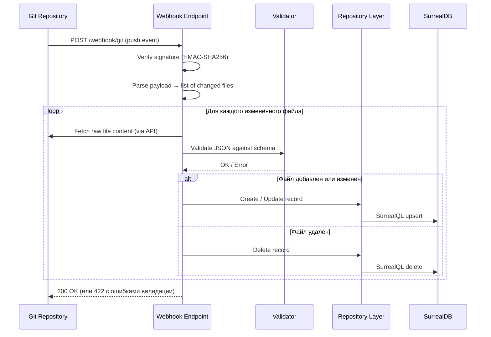
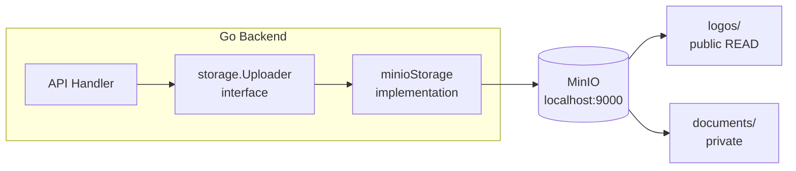
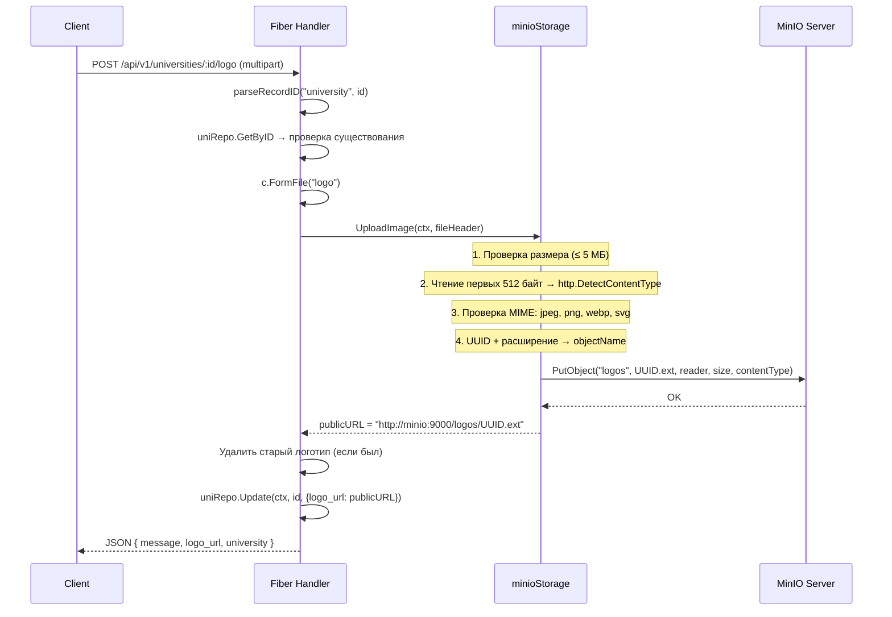
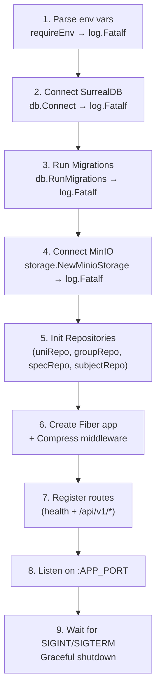

# 4. Backend Services & API

## 4.1 Структура слоёв

Бэкенд v2.0 организован как **тонкая API-прослойка** между клиентскими приложениями и графовой базой данных. Управление данными вынесено в Git-репозиторий (Data-as-Code), поэтому бэкенд отвечает только за:

1. **Роутинг** — маршрутизация HTTP-запросов к нужному репозиторию.
2. **Графовые запросы** — обход графа SurrealDB для сборки сложных ответов.
3. **Медиа-загрузка** — проксирование файлов в MinIO с валидацией.
4. **Webhook-приём** — синхронизация данных из Git-репозитория в SurrealDB (планируется).

```
┌─────────────────────────────────────────────────────────┐
│  HTTP Layer                                             │
│  cmd/api/main.go          — API endpoints (inline)      │
│                              роутинг, middleware         │
├─────────────────────────────────────────────────────────┤
│  Repository Layer (interfaces)                          │
│  internal/repository/*     — Go interfaces + SurrealDB  │
│  internal/storage/*        — Uploader interface + MinIO  │
├─────────────────────────────────────────────────────────┤
│  Models Layer                                           │
│  internal/models/*         — Domain structs, enums       │
├─────────────────────────────────────────────────────────┤
│  Data Layer                                             │
│  internal/db/*             — SurrealDB connection,       │
│                              migrations, schema.surql    │
└─────────────────────────────────────────────────────────┘
```

**Правила зависимостей:**

| Слой       | Может зависеть от                | Не может зависеть от |
| ---------- | -------------------------------- | -------------------- |
| HTTP       | Repository, Models, Storage      | —                    |
| Repository | Models, `surrealdb.DB`           | HTTP                 |
| Models     | Только `surrealdb.go/pkg/models` | Repository, HTTP     |
| Data       | Только `surrealdb.go`, `embed`   | Models, Repository   |

**Что удалено в v2.0 (по сравнению с v1.0):**

| Пакет / слой v1.0  | Назначение                            | Причина удаления                |
| ------------------ | ------------------------------------- | ------------------------------- |
| `internal/admin/*` | HTMX CRUD handlers, renderer, views   | Заменён на Data-as-Code (Git)   |
| `internal/auth/*`  | Google OAuth 2.0, session, middleware | Не нужен — нет веб-админки      |
| `views/**/*.html`  | Go html/template шаблоны              | Не нужен — нет SSR              |
| `static/css/*`     | Tailwind CSS input/output             | Не нужен — нет фронтенд-ассетов |

## 4.2 REST API (`/api/v1`)

### 4.2.1 Таблица эндпоинтов

Все API-эндпоинты — read-only (кроме загрузки логотипа). Аутентификация не требуется — данные публичны.

| Метод  | Путь                            | Описание                                  | Формат ответа |
| ------ | ------------------------------- | ----------------------------------------- | ------------- |
| `GET`  | `/health`                       | Health check                              | JSON          |
| `GET`  | `/api/v1/universities`          | Список вузов (фильтры, пагинация, FTS)    | JSON          |
| `GET`  | `/api/v1/universities/:id`      | Вуз + специальности (графовый обход)      | JSON          |
| `POST` | `/api/v1/universities/:id/logo` | Загрузка логотипа вуза                    | JSON          |
| `GET`  | `/api/v1/groups`                | Список групп ОП                           | JSON          |
| `GET`  | `/api/v1/groups/:id`            | Группа ОП + предметы ЕНТ (графовый обход) | JSON          |
| `GET`  | `/api/v1/specialties`           | Список специальностей                     | JSON          |
| `GET`  | `/api/v1/subjects`              | Список предметов ЕНТ                      | JSON          |

**Итого:** 8 эндпоинтов (включая `/health`).

В v1.0 было ~42 эндпоинта (8 API + ~30 admin + 4 auth). Сокращение на **~80%**.

### 4.2.2 Формат ответов

**Список вузов:**

```/dev/null/response_universities.json#L1-8
[
  {
    "id": "university:abc123",
    "name": { "kz": "...", "ru": "...", "en": "..." },
    "abbr": "КазНУ",
    "city": "Алматы",
    "type": "public"
  }
]
```

**Детали вуза (графовый обход через offers):**

```/dev/null/response_university_detail.json#L1-18
{
  "university": {
    "id": "university:abc123",
    "name": { "kz": "...", "ru": "...", "en": "..." },
    "abbr": "КазНУ",
    "city": "Алматы",
    "type": "public"
  },
  "offers": [
    {
      "id": "offers:xyz789",
      "in": "university:abc123",
      "out": { "id": "specialty:6B06101", "code": "6B06101", "name": { "kz": "...", "ru": "...", "en": "..." } },
      "grant_count": 50,
      "tuition_fee": 1200000,
      "min_score": 70,
      "last_year_threshold": 118
    }
  ]
}
```

**Ошибка:**

```/dev/null/response_error.json#L1-3
{
  "error": "university not found"
}
```

> **Планируется:** стандартизация ответов в формат `{ "data": ..., "meta": { "total": N, "limit": 50, "offset": 0 } }` — см. [Roadmap](./08-roadmap.md).

### 4.2.3 Реализация: inline-хендлеры

Все API-эндпоинты реализованы как inline-функции в `main.go`. Это осознанное решение для тонкого API-слоя — нет необходимости выделять хендлеры в отдельный пакет, пока количество эндпоинтов не превышает ~15.

```cmd/api/main.go#L108-L115
	v1.Get("/universities", func(c *fiber.Ctx) error {
		unis, err := uniRepo.GetAll(c.Context(), defaultUniversityFilters())
		if err != nil {
			return c.Status(fiber.StatusInternalServerError).JSON(fiber.Map{"error": err.Error()})
		}
		return c.JSON(unis)
	})
```

**Паттерн каждого хендлера:**

1. Парсинг параметров (query params, path params).
2. Вызов метода репозитория.
3. Обработка ошибки → JSON с кодом статуса.
4. Возврат результата → JSON.

Нет middleware аутентификации, нет рендеринга шаблонов, нет работы с сессиями. Каждый хендлер — 5–15 строк.

### 4.2.4 Фильтрация и пагинация

**Universities:**

| Query param | Тип    | Описание                             | Пример                |
| ----------- | ------ | ------------------------------------ | --------------------- |
| `city`      | string | Фильтр по городу (точное совпадение) | `?city=Алматы`        |
| `type`      | string | `public` / `private`                 | `?type=public`        |
| `search`    | string | Полнотекстовый поиск (BM25)          | `?search=технический` |
| `lang`      | string | Язык поиска: `kz`, `ru`, `en`        | `?lang=kz`            |
| `limit`     | int    | Макс. количество записей             | `?limit=20`           |
| `offset`    | int    | Смещение для пагинации               | `?offset=40`          |

**Модель фильтров:**

```internal/models/university.go#L50-L66
type UniversityFilters struct {
	City   string
	Type   UniversityType
	Search string
	Lang   string
	Limit  int
	Offset int
}
```

**Построение запроса (university_repo.go):**

```internal/repository/university_repo.go#L77-L115
func (r *surrealUniversityRepo) GetAll(ctx context.Context, f models.UniversityFilters) ([]models.University, error) {
	query := "SELECT * FROM university"
	vars := map[string]any{}
	clauses := []string{}

	if f.City != "" {
		clauses = append(clauses, "city = $city")
		vars["city"] = f.City
	}

	if f.Type != "" && f.Type.IsValid() {
		clauses = append(clauses, "type = $type")
		vars["type"] = string(f.Type)
	}

	if f.Search != "" {
		lang := f.Lang
		if lang == "" {
			lang = "ru"
		}
		switch lang {
		case "kz", "ru", "en":
		default:
			lang = "ru"
		}
		clauses = append(clauses, fmt.Sprintf("name.%s @@ $search", lang))
		vars["search"] = f.Search
	}
	// ... WHERE + ORDER BY + LIMIT + START
}
```

Все пользовательские значения передаются через `$переменные` — конкатенация в строку запроса полностью исключена. Единственное исключение — имя поля `lang`, которое защищено whitelist (`kz`, `ru`, `en`).

## 4.3 Webhook Handler (планируется)

### 4.3.1 Назначение

Webhook handler — это точка входа для GitOps pipeline. Он принимает push-события от Git-хостинга (GitHub/GitLab), парсит изменённые `.json` и `.md` файлы и синхронизирует данные с SurrealDB.

### 4.3.2 Целевая архитектура



### 4.3.3 Целевые эндпоинты

| Метод  | Путь            | Описание                                | Аутентификация   |
| ------ | --------------- | --------------------------------------- | ---------------- |
| `POST` | `/webhook/git`  | Приём push-событий от Git-хостинга      | HMAC-SHA256      |
| `POST` | `/webhook/sync` | Полная синхронизация всех данных из Git | API key / secret |

### 4.3.4 Безопасность webhook

| Мера                 | Описание                                                             |
| -------------------- | -------------------------------------------------------------------- |
| **HMAC-SHA256**      | Подпись payload секретом, известным только Git-хостингу и бэкенду    |
| **IP whitelist**     | Опционально: разрешать webhook только с IP-адресов GitHub/GitLab     |
| **Idempotency**      | Повторная обработка одного и того же push-события безопасна (upsert) |
| **Rate limiting**    | Защита от flood: макс. N запросов в минуту                           |
| **Validation first** | JSON Schema валидация до записи в БД. Невалидные данные отклоняются  |

### 4.3.5 Маппинг файлов на операции

| Путь в Git-репозитории               | Таблица SurrealDB | Операция                          |
| ------------------------------------ | ----------------- | --------------------------------- |
| `data/universities/<slug>.json`      | `university`      | Upsert вуза                       |
| `data/universities/<slug>.md`        | `university`      | Обновить поле `description`       |
| `data/specialties/<code>.json`       | `specialty`       | Upsert специальности              |
| `data/groups/<code>.json`            | `specialty_group` | Upsert группы ОП + связи requires |
| `data/subjects/<name>.json`          | `subject`         | Upsert предмета ЕНТ               |
| Удаление любого из вышеперечисленных | Соответствующая   | Delete + каскадное удаление рёбер |

### 4.3.6 Реализация (целевая)

```/dev/null/webhook_handler.go#L1-45
// POST /webhook/git — приём push-событий от GitHub/GitLab
func webhookHandler(
    uniRepo  repository.UniversityRepository,
    specRepo repository.SpecialtyRepository,
    groupRepo repository.SpecialtyGroupRepository,
    subjectRepo repository.SubjectRepository,
    secret string,
) fiber.Handler {
    return func(c *fiber.Ctx) error {
        // 1. Верификация подписи
        signature := c.Get("X-Hub-Signature-256")
        if !verifyHMAC(c.Body(), signature, secret) {
            return c.Status(fiber.StatusForbidden).JSON(fiber.Map{
                "error": "invalid webhook signature",
            })
        }

        // 2. Парсинг payload → список изменённых файлов
        event, err := parseGitPushEvent(c.Body())
        if err != nil {
            return c.Status(fiber.StatusBadRequest).JSON(fiber.Map{
                "error": "invalid push event payload",
            })
        }

        // 3. Обработка каждого изменённого файла
        var errors []string
        for _, file := range event.ChangedFiles {
            if err := syncFile(c.Context(), file, uniRepo, specRepo, groupRepo, subjectRepo); err != nil {
                errors = append(errors, fmt.Sprintf("%s: %v", file.Path, err))
            }
        }

        if len(errors) > 0 {
            return c.Status(fiber.StatusUnprocessableEntity).JSON(fiber.Map{
                "synced": len(event.ChangedFiles) - len(errors),
                "errors": errors,
            })
        }

        return c.JSON(fiber.Map{
            "synced": len(event.ChangedFiles),
            "status": "ok",
        })
    }
}
```

> **Примечание:** Методы `Create`, `Update`, `Delete` в интерфейсах репозиториев сохранены именно для использования webhook-handler'ом.

## 4.4 Repository Layer

### 4.4.1 Интерфейсы

Каждый репозиторий определён как Go-интерфейс:

| Интерфейс                  | Файл                      | Методы                                                                                                                                     |
| -------------------------- | ------------------------- | ------------------------------------------------------------------------------------------------------------------------------------------ |
| `UniversityRepository`     | `university_repo.go`      | `GetAll`, `GetByID`, `GetWithSpecialties`, `Create`, `Update`, `Delete`, `CreateOffer`, `UpdateOffer`, `DeleteOffer`, `DeleteAllOffers`    |
| `SpecialtyRepository`      | `specialty_repo.go`       | `GetAll`, `GetByID`, `GetByCode`, `Create`, `Update`, `Delete`                                                                             |
| `SpecialtyGroupRepository` | `specialty_group_repo.go` | `GetAll`, `GetByID`, `GetByCode`, `GetWithSubjects`, `Create`, `Update`, `Delete`, `CreateRequires`, `DeleteRequires`, `DeleteAllRequires` |
| `SubjectRepository`        | `subject_repo.go`         | `GetAll`, `GetByID`, `Create`, `Update`, `Delete`, `FindUniversitiesBySubject`                                                             |

**Разделение методов по контурам:**

| Метод                                    | Используется API | Используется Webhook | Описание                   |
| ---------------------------------------- | ---------------- | -------------------- | -------------------------- |
| `GetAll`                                 | ✅               | —                    | Список с фильтрами         |
| `GetByID`                                | ✅               | ✅                   | Получение по ID            |
| `GetByCode`                              | —                | ✅                   | Поиск по коду (для upsert) |
| `GetWithSpecialties` / `GetWithSubjects` | ✅               | —                    | Графовый обход             |
| `Create`                                 | —                | ✅                   | Создание записи из JSON    |
| `Update`                                 | —                | ✅                   | Обновление записи из JSON  |
| `Delete`                                 | —                | ✅                   | Удаление записи            |
| `CreateOffer`                            | —                | ✅                   | Создание ребра графа       |
| `DeleteOffer`                            | —                | ✅                   | Удаление ребра графа       |
| `FindUniversitiesBySubject`              | ✅               | —                    | Обратный обход графа       |

### 4.4.2 Паттерны доступа к данным

**CRUD — Create:**

```/dev/null/repo_create.go#L1-8
data := map[string]any{
    "name": map[string]any{"kz": u.Name.KZ, "ru": u.Name.RU, "en": u.Name.EN},
    "abbr": u.Abbr,
    "city": u.City,
    "type": string(u.Type),
}
result, err := surrealdb.Create[[]models.University](ctx, r.db, surrealmodels.Table("university"), data)
```

`surrealdb.Create` на таблице (`Table`) возвращает массив, даже для одной записи. Десериализация: `[]models.University` → берём `[0]`.

**CRUD — Update (MERGE):**

```/dev/null/repo_update.go#L1
result, err := surrealdb.Merge[models.University](ctx, r.db, id, data)
```

`surrealdb.Merge` реализует PATCH-семантику: обновляет только переданные поля, оставляя остальные без изменений.

**CRUD — Delete:**

```/dev/null/repo_delete.go#L1
_, err := surrealdb.Delete[models.University](ctx, r.db, id)
```

**CRUD — Select (одна запись):**

```/dev/null/repo_select.go#L1
result, err := surrealdb.Select[models.University](ctx, r.db, id)
```

**Query (параметризованный):**

```/dev/null/repo_query.go#L1
results, err := surrealdb.Query[[]models.University](ctx, r.db, query, vars)
```

`surrealdb.Query` возвращает `*[]surrealdb.QueryResult[T]`. Каждый элемент — один statement в запросе. При multi-statement запросах (LET + SELECT) берётся `[len-1]`.

**Graph — Relate:**

```/dev/null/repo_relate.go#L1-6
rel := &surrealdb.Relationship{
    In:       universityID,
    Out:      specialtyID,
    Relation: surrealmodels.Table("offers"),
    Data:     map[string]any{...},
}
result, err := surrealdb.Relate[models.Offers](ctx, r.db, rel)
```

### 4.4.3 Обработка ошибок в репозиториях

Все ошибки оборачиваются через `fmt.Errorf` с контекстом:

```/dev/null/repo_errors.go#L1-3
return nil, fmt.Errorf("university.GetAll: query: %w", err)
return nil, fmt.Errorf("university.Create: %w", err)
return fmt.Errorf("university.Delete: %w", err)
```

Паттерн `"entity.Method: context: %w"` позволяет трассировать ошибку по цепочке через `errors.Is/As`.

> **Замечание из code audit:** подход к «not found» неконсистентен. Рекомендуется единый подход: sentinel-ошибка `ErrNotFound` или `(nil, nil)` для отсутствия записи.

## 4.5 Интеграция с MinIO

### 4.5.1 Архитектура хранилища



**Интерфейс `Uploader`:**

```/dev/null/uploader_interface.go#L1-5
type Uploader interface {
    UploadImage(ctx context.Context, file *multipart.FileHeader) (string, error)
    UploadDocument(ctx context.Context, file *multipart.FileHeader) (string, error)
    DeleteFile(ctx context.Context, bucket, fileName string) error
}
```

Интерфейс абстрагирует хранилище — для тестов можно подставить in-memory реализацию.

### 4.5.2 Поток загрузки изображения



### 4.5.3 Валидация загружаемых файлов

| Проверка        | Механизм                            | Значение                                                           |
| --------------- | ----------------------------------- | ------------------------------------------------------------------ |
| Размер          | `file.Size > maxLogoSize`           | ≤ 5 МБ (5 << 20)                                                   |
| Content-Type    | `http.DetectContentType(buf[:512])` | Детекция по содержимому, не по заголовку                           |
| Допустимые типы | `allowedImageTypes` map             | `image/jpeg`, `image/png`, `image/webp`, `image/svg+xml`           |
| SVG fallback    | Проверка расширения `.svg`          | `http.DetectContentType` не распознаёт SVG (возвращает `text/xml`) |
| Имя файла       | `uuid.New().String() + ext`         | UUID v4, исключает коллизии и path traversal                       |

### 4.5.4 Инициализация бакетов

При старте приложения `NewMinioStorage` выполняет:

1. Создание MinIO-клиента и health check (`ListBuckets`).
2. Проверка / создание бакетов `logos` и `documents`.
3. Установка S3 bucket policy для `logos`:

```/dev/null/logos_policy.json#L1-10
{
  "Version": "2012-10-17",
  "Statement": [
    {
      "Effect": "Allow",
      "Principal": { "AWS": ["*"] },
      "Action": ["s3:GetObject"],
      "Resource": ["arn:aws:s3:::logos/*"]
    }
  ]
}
```

Это делает все объекты в бакете `logos` доступными по прямому URL без аутентификации. Бакет `documents` остаётся приватным.

### 4.5.5 Проксирование vs прямой доступ

| Бакет       | Модель доступа                              | URL в браузере                                              |
| ----------- | ------------------------------------------- | ----------------------------------------------------------- |
| `logos`     | Прямой доступ (public policy)               | `http://minio:9000/logos/uuid.png`                          |
| `documents` | Проксирование через бэкенд (не реализовано) | Планируется через presigned URL или `/api/v1/documents/:id` |

В базе данных хранится полный публичный URL (`publicEndpoint + "/" + bucket + "/" + objectName`).

## 4.6 Инициализация приложения

Порядок инициализации в `main.go` реализует принцип **fail-fast**:



**Упрощение по сравнению с v1.0:**

В v1.0 инициализация включала 10 шагов, включая проверку build tag (`IsNoAuth?`), загрузку OAuth-конфигурации, инициализацию goth-провайдеров, создание session store и регистрацию ~40 маршрутов. В v2.0 — 9 шагов, 8 маршрутов, без условных ветвлений.

Если любой из компонентов (SurrealDB, MinIO) недоступен при старте — процесс завершается с `log.Fatalf`. Это предотвращает работу сервиса в деградированном состоянии.

**Graceful Shutdown:**

```cmd/api/main.go#L211-L226
	quit := make(chan os.Signal, 1)
	signal.Notify(quit, os.Interrupt, syscall.SIGTERM)

	go func() {
		if err := app.Listen(":" + appPort); err != nil {
			log.Fatalf("Ошибка запуска сервера: %v", err)
		}
	}()

	log.Printf("[app] listening on :%s", appPort)

	<-quit
	log.Println("[app] shutting down...")

	shutdownCtx, cancel := context.WithTimeout(ctx, 5*time.Second)
	defer cancel()

	if err := app.ShutdownWithContext(shutdownCtx); err != nil {
		log.Printf("[app] server shutdown error: %v", err)
	}
	if err := surrealDB.Close(shutdownCtx); err != nil {
		log.Printf("[app] db close error: %v", err)
	}

	log.Println("[app] stopped")
```

## 4.7 Подключение к SurrealDB

```internal/db/database.go#L40-L67
func Connect(ctx context.Context, cfg Config) (*surrealdb.DB, error) {
	db, err := surrealdb.FromEndpointURLString(ctx, cfg.URL)
	if err != nil {
		return nil, fmt.Errorf("db: connect to %s: %w", cfg.URL, err)
	}
	if _, err = db.SignIn(ctx, map[string]any{
		"user": cfg.User,
		"pass": cfg.Pass,
	}); err != nil {
		return nil, fmt.Errorf("db: sign in: %w", err)
	}
	if err = db.Use(ctx, cfg.Namespace, cfg.Database); err != nil {
		return nil, fmt.Errorf("db: use %s/%s: %w", cfg.Namespace, cfg.Database, err)
	}
	log.Printf("[db] connected to %s  ns=%s  db=%s", cfg.URL, cfg.Namespace, cfg.Database)
	return db, nil
}
```

| Параметр  | Env            | Dev-значение              | Описание               |
| --------- | -------------- | ------------------------- | ---------------------- |
| URL       | `SURREAL_URL`  | `ws://localhost:8000/rpc` | WebSocket RPC endpoint |
| User      | `SURREAL_USER` | `root`                    | Root credentials       |
| Pass      | `SURREAL_PASS` | `root`                    | Root password          |
| Namespace | `SURREAL_NS`   | `universities`            | Логическая изоляция    |
| Database  | `SURREAL_DB`   | `universities`            | База внутри namespace  |

> **Примечание:** бэкенд подключается с root-credentials. В Data-as-Code архитектуре это менее критично, чем в v1.0, поскольку бэкенд обслуживает только read-heavy API, а запись данных происходит через контролируемый webhook pipeline.

## 4.8 Переменные окружения (полный список)

| Переменная            | Обязательная      | Описание                         | Dev-значение              |
| --------------------- | ----------------- | -------------------------------- | ------------------------- |
| `SURREAL_URL`         | Да (`requireEnv`) | WebSocket URL SurrealDB          | `ws://localhost:8000/rpc` |
| `SURREAL_USER`        | Да                | Root user                        | `root`                    |
| `SURREAL_PASS`        | Да                | Root password                    | `root`                    |
| `SURREAL_NS`          | Да                | Namespace                        | `universities`            |
| `SURREAL_DB`          | Да                | Database                         | `universities`            |
| `APP_PORT`            | Да                | Порт HTTP-сервера                | `3000`                    |
| `MINIO_ENDPOINT`      | Да                | MinIO endpoint (без схемы)       | `localhost:9000`          |
| `MINIO_ROOT_USER`     | Да                | MinIO access key                 | `minioadmin`              |
| `MINIO_ROOT_PASSWORD` | Да                | MinIO secret key                 | `minioadmin`              |
| `MINIO_PUBLIC_URL`    | Да                | Внешний URL для публичных ссылок | `http://localhost:9000`   |
| `MINIO_USE_SSL`       | Нет (`os.Getenv`) | Использовать HTTPS               | `false`                   |
| `APP_ENV`             | Нет (`os.Getenv`) | `development` / `production`     | `development`             |

**Удалено в v2.0:**

| Переменная (v1.0)      | Назначение                 | Причина удаления             |
| ---------------------- | -------------------------- | ---------------------------- |
| `GOOGLE_CLIENT_ID`     | Google OAuth Client ID     | Нет OAuth — Data-as-Code     |
| `GOOGLE_CLIENT_SECRET` | Google OAuth Client Secret | Нет OAuth — Data-as-Code     |
| `GOOGLE_CALLBACK_URL`  | OAuth Callback URL         | Нет OAuth — Data-as-Code     |
| `SESSION_SECRET`       | Секрет для cookie-сессий   | Нет сессий — нет веб-админки |

**Будет добавлено (для webhook):**

| Переменная            | Описание                                      |
| --------------------- | --------------------------------------------- |
| `WEBHOOK_SECRET`      | HMAC-SHA256 секрет для верификации webhook    |
| `GIT_DATA_REPO_URL`   | URL Git-репозитория с данными (для full sync) |
| `GIT_DATA_REPO_TOKEN` | PAT для доступа к приватному Git-репозиторию  |

## 4.9 Middleware-стек

В v2.0 middleware-стек радикально упрощён:

| Middleware                   | v1.0 | v2.0 | Описание                                |
| ---------------------------- | ---- | ---- | --------------------------------------- |
| `compress`                   | ✅   | ✅   | Gzip/Deflate сжатие ответов             |
| `static` (CSS/JS/images)     | ✅   | ❌   | Удалён — нет фронтенд-ассетов           |
| `session`                    | ✅   | ❌   | Удалён — нет cookie-auth                |
| `auth.AuthRequired`          | ✅   | ❌   | Удалён — нет admin-маршрутов            |
| `auth.NoAuthMiddleware`      | ✅   | ❌   | Удалён — нет build tag `noauth`         |
| `cors` (планируется)         | ❌   | 🔲   | Для React SPA / внешних клиентов        |
| `limiter` (планируется)      | ❌   | 🔲   | Rate limiting для публичного API        |
| `helmet` (планируется)       | ❌   | 🔲   | Security headers (CSP, X-Frame-Options) |
| `webhook HMAC` (планируется) | ❌   | 🔲   | Верификация подписи webhook-запросов    |

Текущая конфигурация:

```cmd/api/main.go#L93-L97
	app.Use(compress.New(compress.Config{
		Level: compress.LevelDefault,
	}))
```

---

_Предыдущий раздел: [← Data Layer](./03-data-layer.md)_
_Следующий раздел: [Security & AppSec →](./05-security.md)_
