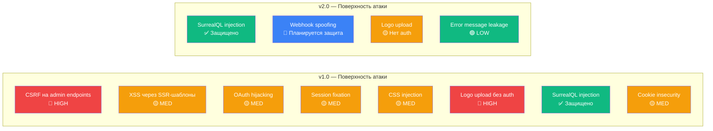
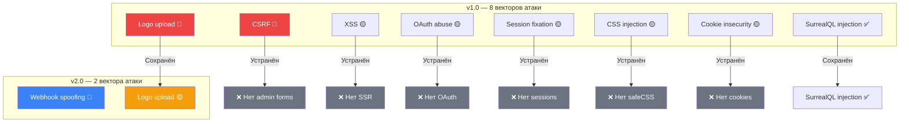

# 5. Security & AppSec

## 5.0 Архитектурный сдвиг безопасности (v1.0 → v2.0)

Переход на **Data-as-Code** архитектуру — это в первую очередь решение по безопасности. Устранение веб-админки, OAuth, сессий и cookie-auth **отсекает целый класс атак**, которые составляли большинство находок в аудитах v1.0.



### Сводка: что устранено переходом на Data-as-Code

| #   | Уязвимость v1.0                                          | Критичность  | Статус в v2.0 | Причина устранения                                      |
| --- | -------------------------------------------------------- | ------------ | ------------- | ------------------------------------------------------- |
| 1   | **CSRF на admin endpoints** (FINDING 3.1)                | 🔴 HIGH      | ✅ Устранена  | Нет admin endpoints — нет state-changing форм           |
| 2   | **POST /api/v1/.../logo без auth** (FINDING 3.4)         | 🔴 HIGH      | 🟡 Осталась   | Эндпоинт сохранён, но контекст изменился (см. ниже)     |
| 3   | **XSS через SSR-шаблоны** (FINDING 2.x)                  | 🟡 MED       | ✅ Устранена  | Нет SSR — нет `html/template` — нет XSS через рендеринг |
| 4   | **CSS Injection через `safeCSS`** (FINDING 2.3)          | 🟡 MED       | ✅ Устранена  | `safeCSS` удалена вместе с шаблонами                    |
| 5   | **`safeHTML` в template FuncMap** (FINDING 2.2)          | 🟢 LOW       | ✅ Устранена  | Шаблоны удалены                                         |
| 6   | **LogoURL в `src=` без валидации** (FINDING 2.4)         | 🟢 LOW       | ✅ Устранена  | Нет SSR — URL используется только в JSON API            |
| 7   | **Cookie `Secure: false`** (FINDING 3.3)                 | 🟡 MED       | ✅ Устранена  | Нет cookie-based auth — нет cookie                      |
| 8   | **Отсутствие CORS middleware** (FINDING 3.2)             | 🟡 MED       | 🔲 Осталась   | Планируется при подключении React SPA                   |
| 9   | **PERMISSIONS FULL в SurrealDB** (FINDING 1.4)           | 🟡 MED       | 🟡 Осталась   | Root-credentials по-прежнему обходят PERMISSIONS        |
| 10  | **Error messages раскрывают внутренности** (FINDING 5.1) | 🟢 LOW       | 🟡 Осталась   | `err.Error()` по-прежнему утекает в JSON API            |
| 11  | **Отсутствие Security Headers** (FINDING 5.2)            | 🟡 MED       | 🔲 Осталась   | Планируется `helmet` middleware                         |
| 12  | **SurrealDB in-memory** (FINDING 5.3)                    | 🟢 LOW (ops) | 🟡 Осталась   | `memory` в docker-compose                               |
| 13  | **Нет ролевой модели** (FINDING 4.3)                     | 🟢 LOW       | ✅ Устранена  | Управление через Git permissions (branches, CODEOWNERS) |
| 14  | **OAuth state / session hijacking**                      | 🟡 MED       | ✅ Устранена  | Нет OAuth — нет session                                 |

**Итого:** из 14 находок v1.0 — **8 полностью устранены** архитектурным решением, **2 остались как есть**, **4 требуют работы** (но уровень критичности снижен).

---

## 5.1 Текущие меры защиты

### 5.1.1 Защита от SurrealQL Injection

**Статус: ✅ Реализовано**

Все репозитории используют параметризованные запросы через `surrealdb.Query` с `map[string]any`. Пользовательский ввод передаётся через переменные `$variable` — конкатенация в строку запроса полностью исключена.

```internal/repository/university_repo.go#L89-L93
	if f.City != "" {
		clauses = append(clauses, "city = $city")
		vars["city"] = f.City
	}
```

Единственное место с `fmt.Sprintf` в теле запроса — интерполяция имени поля для выбора языка полнотекстового поиска. Защита реализована через whitelist:

```internal/repository/university_repo.go#L99-L107
	if f.Search != "" {
		lang := f.Lang
		if lang == "" {
			lang = "ru"
		}
		switch lang {
		case "kz", "ru", "en":
		default:
			lang = "ru"
		}
		clauses = append(clauses, fmt.Sprintf("name.%s @@ $search", lang))
		vars["search"] = f.Search
	}
```

Аналогичная логика применяется в `specialty_repo.go` и `specialty_group_repo.go`.

**Отсутствие DEFINE FUNCTION / embedded JS:**

В `schema.surql` нет конструкций `DEFINE FUNCTION` и нет встроенного JavaScript — только `DEFINE TABLE`, `DEFINE FIELD`, `DEFINE INDEX`. Это исключает Server-Side JavaScript Injection.

### 5.1.2 Валидация загружаемых файлов

**Статус: ✅ Реализовано**

Загрузка логотипов через `POST /api/v1/universities/:id/logo` проходит серверную валидацию:

| Проверка        | Механизм                            | Значение                                                           |
| --------------- | ----------------------------------- | ------------------------------------------------------------------ |
| Размер          | `file.Size > maxLogoSize`           | ≤ 5 МБ (5 << 20)                                                   |
| Content-Type    | `http.DetectContentType(buf[:512])` | Детекция по содержимому, не по заголовку                           |
| Допустимые типы | `allowedImageTypes` map             | `image/jpeg`, `image/png`, `image/webp`, `image/svg+xml`           |
| SVG fallback    | Проверка расширения `.svg`          | `http.DetectContentType` не распознаёт SVG (возвращает `text/xml`) |
| Имя файла       | `uuid.New().String() + ext`         | UUID v4, исключает коллизии и path traversal                       |

### 5.1.3 SCHEMAFULL-валидация в SurrealDB

**Статус: ✅ Реализовано**

Все таблицы определены как `SCHEMAFULL` с `ASSERT`-ограничениями:

```internal/db/schema.surql#L40-L42
DEFINE FIELD OVERWRITE type           ON TABLE university TYPE string
    ASSERT $value IN ["public", "private"];
```

```internal/db/schema.surql#L253-L254
DEFINE FIELD OVERWRITE min_score          ON TABLE offers TYPE int
    ASSERT $value >= 0 AND $value <= 140;
```

Это обеспечивает двойную валидацию:

1. **На уровне Go-типов** — `models/common.go: UniversityType.IsValid()`.
2. **На уровне БД** — SurrealDB отвергает записи с невалидными типами и значениями.

В v2.0 добавляется третий уровень: **JSON Schema в CI** при коммите данных в Git-репозиторий.

### 5.1.4 Data-as-Code: безопасность через архитектуру

**Статус: ✅ Реализовано (архитектурная мера)**

Переход на Data-as-Code устраняет следующие вектора атак **by design**:

| Вектор атаки                          | Почему устранён                                                                       |
| ------------------------------------- | ------------------------------------------------------------------------------------- |
| **CSRF**                              | Нет state-changing HTML-форм → нет CSRF                                               |
| **XSS (Reflected/Stored)**            | Нет SSR-рендеринга пользовательских данных в HTML                                     |
| **Session hijacking/fixation**        | Нет cookie-based сессий                                                               |
| **OAuth token theft**                 | Нет OAuth flow → нет access/refresh токенов                                           |
| **Brute-force / credential stuffing** | Нет логин-формы                                                                       |
| **Privilege escalation**              | Нет ролевой модели в приложении → используется Git permissions (branches, CODEOWNERS) |
| **CSS Injection**                     | Нет `safeCSS` / `template.CSS` → `custom_css` отдаётся как JSON-строка                |

### 5.1.5 Аутентификация редакторов данных

**Статус: ✅ Делегировано Git-хостингу**

| Аспект             | v1.0 (приложение)                  | v2.0 (Git-хостинг)                          |
| ------------------ | ---------------------------------- | ------------------------------------------- |
| Аутентификация     | Google OAuth 2.0                   | SSH-ключи / PAT / SSO (GitHub, GitLab)      |
| Авторизация        | Whitelist email в `allowed_admins` | Repository access + branch protection       |
| Разграничение прав | Нет (все админы равны)             | CODEOWNERS + PR review + protected branches |
| Аудит действий     | Логи приложения                    | `git log` — навсегда, с автором             |
| MFA                | Зависит от Google аккаунта         | Настраивается на уровне организации         |
| Отзыв доступа      | Удаление email из `allowed_admins` | Revoke repository access                    |

---

## 5.2 Оставшиеся уязвимости и план устранения

### 5.2.1 🟡 MED: POST /api/v1/universities/:id/logo без аутентификации

**Унаследовано из v1.0 (FINDING 3.4).**

```cmd/api/main.go#L158-L160
	v1.Post("/universities/:id/logo", func(c *fiber.Ctx) error {
		// Нет проверки аутентификации
		id, err := parseRecordID("university", c.Params("id"))
```

**Контекст в v2.0:**

В v1.0 это была **HIGH**-уязвимость, потому что админка подразумевала аутентифицированный доступ для записи. В v2.0 уровень снижен до **MED**, так как:

- Все остальные write-операции выполняются через webhook (контролируемый канал).
- Этот эндпоинт — единственная точка неаутентифицированной записи.

**Риск:** Любой пользователь может загрузить файл и заменить логотип вуза. SVG-файлы могут содержать `<script>`, хотя в контексте JSON API (не SSR) это менее опасно.

**План устранения:**

| Вариант | Описание                                                                              | Оценка   |
| ------- | ------------------------------------------------------------------------------------- | -------- |
| A       | Удалить эндпоинт, загружать логотипы через MinIO CLI / S3 API как часть data pipeline | 15 мин   |
| B       | Добавить API-key аутентификацию (`X-API-Key` header)                                  | 30 мин   |
| C       | Переместить загрузку логотипов в webhook pipeline (Git LFS или URL в JSON)            | 1–2 часа |

**Рекомендация:** Вариант C — логотип указывается как URL в JSON-файле вуза, бэкенд скачивает и валидирует его при webhook-синхронизации. Это полностью устраняет публичный write-endpoint.

### 5.2.2 🟡 MED: PERMISSIONS FULL на всех таблицах

**Унаследовано из v1.0 (FINDING 1.4).**

Все таблицы в `schema.surql` определены с `PERMISSIONS FULL`:

```/dev/null/schema_permissions.surql#L1-2
DEFINE TABLE OVERWRITE university SCHEMAFULL
    PERMISSIONS FULL;
```

**Контекст в v2.0:**

Бэкенд подключается с root-credentials, которые обходят `PERMISSIONS`. В Data-as-Code архитектуре это менее критично:

- Нет публичного доступа к SurrealDB (WebSocket-порт не exposed наружу).
- Все запросы проходят через Go API, который контролирует доступ.
- Запись данных — через webhook pipeline (не через прямое подключение к БД).

**Риск:** При добавлении scope-based доступа (например, для прямого подключения публичных клиентов к SurrealDB через GraphQL) `PERMISSIONS FULL` станет критической уязвимостью.

**План устранения:**

```/dev/null/schema_permissions_fix.surql#L1-3
DEFINE TABLE OVERWRITE university SCHEMAFULL
    PERMISSIONS
        FOR select FULL, FOR create, update, delete NONE;
```

Deny-by-default для записи. Root-credentials бэкенда по-прежнему обходят permissions, но scope-based клиенты будут ограничены.

### 5.2.3 🟡 MED: Отсутствие CORS middleware

**Унаследовано из v1.0 (FINDING 3.2).**

Fiber-приложение не настраивает CORS. В текущем состоянии (бэкенд и клиент на одном домене) это не является уязвимостью. Проблема возникнет при подключении React SPA на отдельном домене.

**План устранения:**

```/dev/null/cors_middleware.go#L1-10
import "github.com/gofiber/fiber/v2/middleware/cors"

app.Use(cors.New(cors.Config{
    AllowOrigins:     "https://app.universities.kz, http://localhost:3001",
    AllowMethods:     "GET, POST",
    AllowHeaders:     "Content-Type, X-API-Key",
    AllowCredentials: false, // Нет cookie-auth в v2.0
    MaxAge:           3600,
}))
```

### 5.2.4 🟡 MED: Отсутствие Security Headers

**Унаследовано из v1.0 (FINDING 5.2).**

HTTP-ответы не содержат security headers (CSP, X-Frame-Options, X-Content-Type-Options и др.).

**План устранения:**

```/dev/null/helmet_middleware.go#L1-8
import "github.com/gofiber/helmet/v2"

app.Use(helmet.New(helmet.Config{
    ContentSecurityPolicy:   "default-src 'none'; frame-ancestors 'none'",
    XFrameOptions:           "DENY",
    XContentTypeOptions:     "nosniff",
    ReferrerPolicy:          "strict-origin-when-cross-origin",
}))
```

### 5.2.5 🟢 LOW: Error messages раскрывают внутренности

**Унаследовано из v1.0 (FINDING 5.1).**

API-хендлеры возвращают `err.Error()` напрямую клиенту:

```cmd/api/main.go#L113
		return c.Status(fiber.StatusInternalServerError).JSON(fiber.Map{"error": err.Error()})
```

Это может раскрыть структуру SurrealQL-запросов, имена таблиц и полей.

**План устранения:**

```/dev/null/error_handling.go#L1-6
// Generic ответ клиенту
c.Status(fiber.StatusInternalServerError).JSON(fiber.Map{"error": "internal error"})

// Детальное логирование на сервере
log.Printf("[api] GET /universities error: %v", err)
```

### 5.2.6 🟢 LOW: SurrealDB in-memory (operational)

**Унаследовано из v1.0 (FINDING 5.3).**

```docker-compose.yml#L7
    command: start --log debug --user ${SURREAL_USER} --pass ${SURREAL_PASS} memory
```

Данные теряются при рестарте контейнера. В Data-as-Code архитектуре это менее критично (БД можно восстановить из Git через full sync webhook), но в production следует использовать persistent storage.

**План устранения:**

```/dev/null/docker-compose-fix.yml#L1-5
    command: start --log info --user ${SURREAL_USER} --pass ${SURREAL_PASS} file:/data/surreal.db
    volumes:
      - surreal_data:/data
```

### 5.2.7 🔲 PLANNED: Webhook spoofing

**Новый вектор в v2.0.**

Webhook endpoint (`POST /webhook/git`) — единственная точка входа для записи данных (кроме logo upload). Без защиты злоумышленник может отправить поддельный webhook и перезаписать данные в БД.

**План устранения:**

| Мера                         | Описание                                                                             | Приоритет |
| ---------------------------- | ------------------------------------------------------------------------------------ | --------- |
| **HMAC-SHA256 verification** | Каждый webhook подписывается секретом. Бэкенд верифицирует подпись перед обработкой. | 🔴 P0     |
| **IP whitelist**             | Разрешать webhook только с IP-адресов GitHub/GitLab                                  | 🟡 P1     |
| **Rate limiting**            | Макс. N webhook-запросов в минуту                                                    | 🟡 P1     |
| **JSON Schema validation**   | Невалидные данные не записываются в БД                                               | 🔴 P0     |
| **Idempotency**              | Повторная обработка push-события безопасна (upsert)                                  | 🔴 P0     |

```/dev/null/webhook_hmac.go#L1-18
func verifyWebhookSignature(body []byte, signatureHeader, secret string) bool {
    // GitHub: X-Hub-Signature-256 = sha256=<hex>
    // GitLab: X-Gitlab-Token = <plain secret>

    if !strings.HasPrefix(signatureHeader, "sha256=") {
        return false
    }

    expected := hmac.New(sha256.New, []byte(secret))
    expected.Write(body)
    expectedHex := hex.EncodeToString(expected.Sum(nil))

    actual := strings.TrimPrefix(signatureHeader, "sha256=")

    return hmac.Equal([]byte(expectedHex), []byte(actual))
}
```

---

## 5.3 Сводная таблица рисков (v2.0)

| #   | Уязвимость                   | Критичность  | Статус           | Фаза устранения |
| --- | ---------------------------- | ------------ | ---------------- | --------------- |
| 1   | Logo upload без auth         | 🟡 MED       | Осталась из v1.0 | Phase 0         |
| 2   | PERMISSIONS FULL в SurrealDB | 🟡 MED       | Осталась из v1.0 | Phase 1         |
| 3   | Отсутствие CORS middleware   | 🟡 MED       | Осталась из v1.0 | Phase 1         |
| 4   | Отсутствие Security Headers  | 🟡 MED       | Осталась из v1.0 | Phase 1         |
| 5   | Error messages leak          | 🟢 LOW       | Осталась из v1.0 | Phase 1         |
| 6   | SurrealDB in-memory          | 🟢 LOW (ops) | Осталась из v1.0 | Phase 0         |
| 7   | Webhook spoofing             | 🟡 MED       | Новая в v2.0     | Phase 0         |

**Сравнение с v1.0:**

| Метрика       | v1.0 | v2.0 |
| ------------- | ---- | ---- |
| Всего находок | 14   | 7    |
| 🔴 HIGH       | 2    | 0    |
| 🟡 MED        | 7    | 4    |
| 🟢 LOW        | 5    | 2    |
| 🔲 Новые      | —    | 1    |

---

## 5.4 Топ-3 действия для hardening

### 1. Защитить webhook endpoint (HMAC-SHA256)

Единственный write-path в v2.0. Без защиты — эквивалент открытой админки.

**Время:** 1–2 часа.
**Эффект:** Закрывает webhook spoofing.

### 2. Убрать публичный logo upload или защитить API-key

Единственный неаутентифицированный write-endpoint. Рекомендуется переместить загрузку в webhook pipeline (URL логотипа в JSON → бэкенд скачивает при sync).

**Время:** 30 мин (удаление) / 2 часа (миграция в webhook).
**Эффект:** Устраняет последний MED из v1.0.

### 3. SurrealDB persistent storage

`memory` → `file:` + volume в docker-compose. В Data-as-Code архитектуре потеря БД нестрашна (восстановление из Git), но downtime на full sync нежелателен.

**Время:** 15 мин.
**Эффект:** Данные не теряются при рестарте.

---

## 5.5 Архитектурные принципы безопасности

### 5.5.1 Реализованные в v2.0

| Принцип                       | Реализация                                                                        |
| ----------------------------- | --------------------------------------------------------------------------------- |
| **Minimal attack surface**    | Устранение админки, OAuth, сессий, SSR. Бэкенд — read-only API + webhook.         |
| **Defense in depth**          | JSON Schema (CI) → Go-типы (компиляция) → SurrealDB SCHEMAFULL (runtime).         |
| **Parameterized queries**     | Все SurrealQL-запросы используют `$variable` — инъекция невозможна.               |
| **Fail-fast**                 | Недоступные зависимости → `log.Fatalf` при старте.                                |
| **File upload validation**    | Content-Type detection по содержимому, whitelist MIME, лимит размера, UUID-имена. |
| **Separation of concerns**    | Запись данных — Git. Чтение данных — API. Разные модели безопасности.             |
| **Audit trail**               | Все изменения данных — в `git log` с автором, датой, diff.                        |
| **No shared secrets in code** | Все секреты через env-переменные, не hardcoded.                                   |

### 5.5.2 Планируемые

| Принцип                | Мера                                                                    | Фаза    |
| ---------------------- | ----------------------------------------------------------------------- | ------- |
| **Webhook integrity**  | HMAC-SHA256 верификация подписи                                         | Phase 0 |
| **Deny-by-default**    | SurrealDB PERMISSIONS: `FOR select FULL, FOR create/update/delete NONE` | Phase 1 |
| **CORS whitelist**     | Разрешённые origins для React SPA                                       | Phase 1 |
| **Security headers**   | `helmet` middleware (CSP, X-Frame-Options, nosniff)                     | Phase 1 |
| **Rate limiting**      | `fiber/middleware/limiter` для API и webhook                            | Phase 1 |
| **Error sanitization** | Generic ошибки клиенту, детальные — в slog                              | Phase 1 |
| **Structured logging** | `slog` с request_id для трассировки                                     | Phase 1 |

---

## 5.6 Сравнение поверхности атаки: v1.0 vs v2.0



**Количественное сокращение:**

- Вектора атаки: 8 → 2 (**−75%**)
- HIGH-уязвимости: 2 → 0 (**−100%**)
- Код, связанный с безопасностью (auth, session, CSRF, CSS sanitizer): ~500 строк → 0 (**−100%**)

---

_Предыдущий раздел: [← Backend Services & API](./04-backend-services.md)_
_Следующий раздел: [Infrastructure →](./06-infrastructure.md)_
