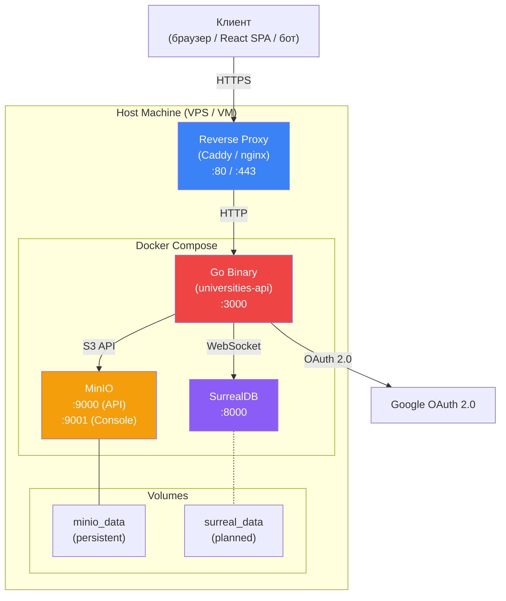
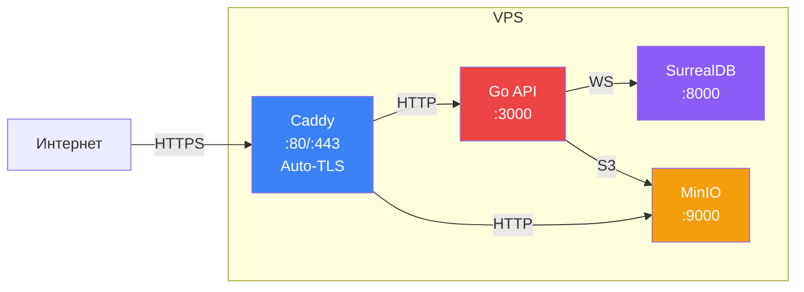
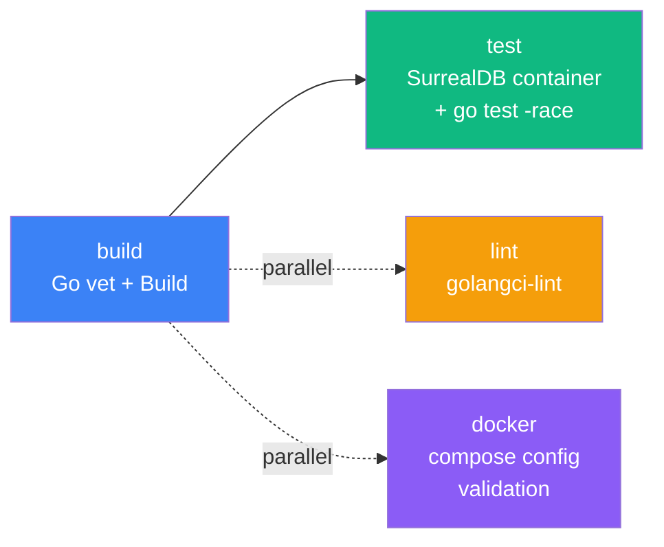
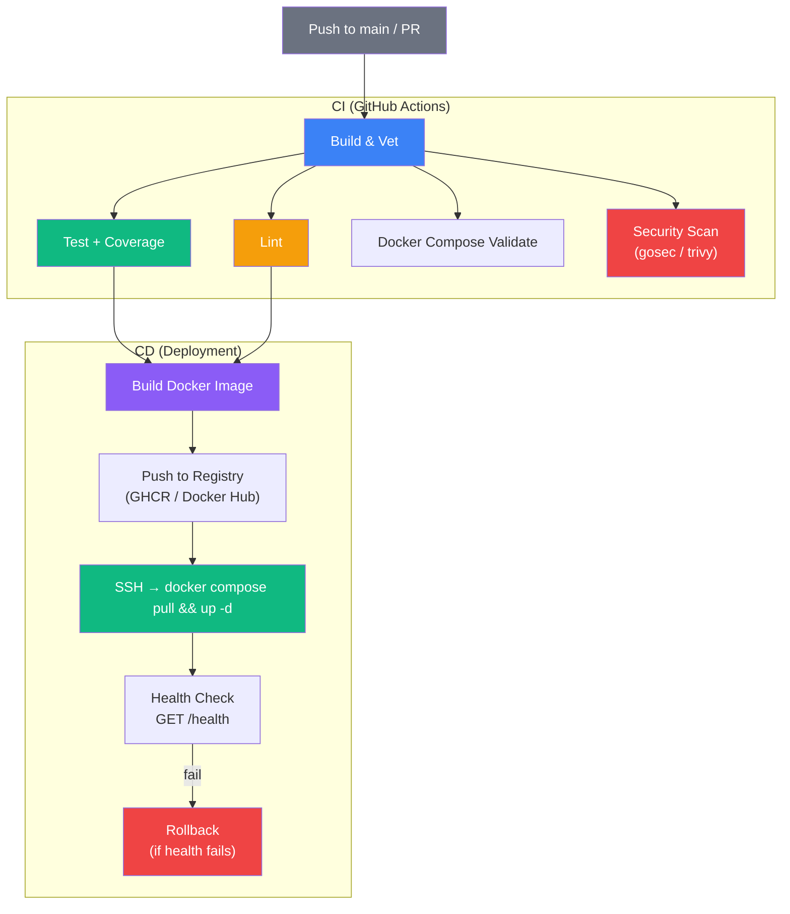
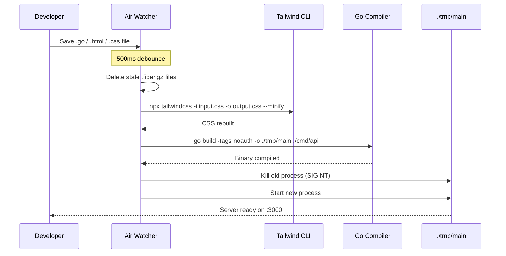
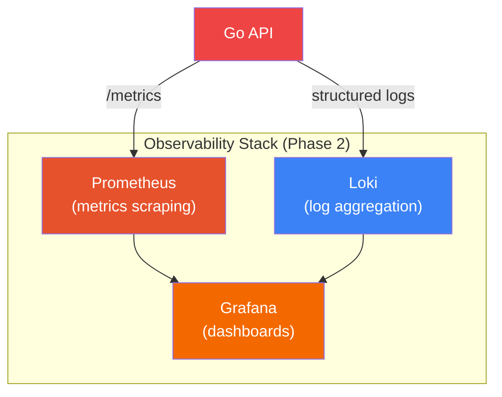
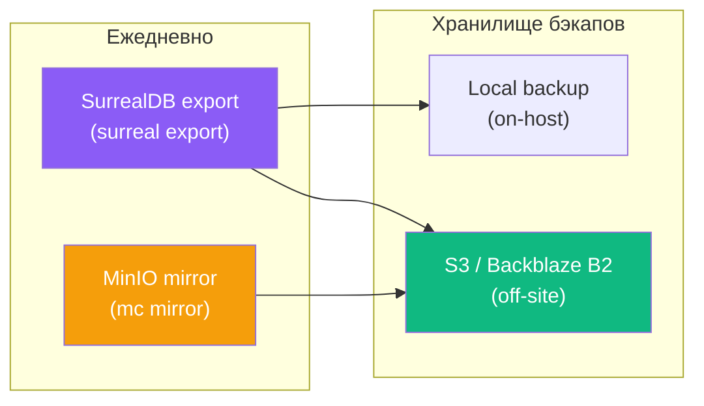
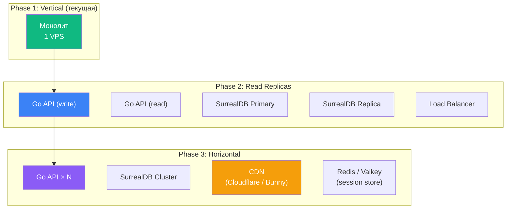

# 6. Infrastructure & Deployment

## 6.1 Обзор инфраструктуры

Universities KZ развёртывается как набор контейнеров, управляемых через Docker Compose. Архитектура следует принципу **minimal moving parts** — три сервиса покрывают все потребности системы.



| Компонент | Образ / Бинарник | Порт | Хранилище | Состояние |
|-----------|-----------------|------|-----------|-----------|
| **Go API** | Собранный бинарник (`./cmd/api`) | `:3000` | Stateless (embed шаблоны) | ✅ Работает |
| **SurrealDB** | `surrealdb/surrealdb:latest` | `:8000` | `memory` (dev) → `file:` (prod) | ⚠️ In-memory |
| **MinIO** | `minio/minio:latest` | `:9000`, `:9001` | `minio_data` volume | ✅ Persistent |
| **Reverse Proxy** | Caddy / nginx | `:80`, `:443` | — | 🔲 Планируется |

---

## 6.2 Docker Compose

### 6.2.1 Текущая конфигурация

```docker-compose.yml#L1-L25
services:
  # Наша база данных будущего
  surrealdb:
    image: surrealdb/surrealdb:latest
    container_name: universities_db
    ports:
      - "8000:8000"
    command: start --log debug --user ${SURREAL_USER} --pass ${SURREAL_PASS} memory
    restart: always

  # S3 хранилище для логотипов
  minio:
    image: minio/minio:latest
    container_name: universities_minio
    ports:
      - "9000:9000"
      - "9001:9001"
    environment:
      MINIO_ROOT_USER: ${MINIO_ROOT_USER}
      MINIO_ROOT_PASSWORD: ${MINIO_ROOT_PASSWORD}
    command: server /data --console-address ":9001"
    volumes:
      - minio_data:/data
    restart: always
```

### 6.2.2 Целевая конфигурация (Production)

```/dev/null/docker-compose.prod.yml#L1-L67
services:
  app:
    build:
      context: .
      dockerfile: Dockerfile
    container_name: universities_api
    ports:
      - "3000:3000"
    environment:
      - APP_ENV=production
      - APP_PORT=3000
      - SURREAL_URL=ws://surrealdb:8000/rpc
      - SURREAL_USER=${SURREAL_USER}
      - SURREAL_PASS=${SURREAL_PASS}
      - SURREAL_NS=${SURREAL_NS}
      - SURREAL_DB=${SURREAL_DB}
      - MINIO_ENDPOINT=minio:9000
      - MINIO_ROOT_USER=${MINIO_ROOT_USER}
      - MINIO_ROOT_PASSWORD=${MINIO_ROOT_PASSWORD}
      - MINIO_USE_SSL=false
      - MINIO_PUBLIC_URL=${MINIO_PUBLIC_URL}
      - GOOGLE_CLIENT_ID=${GOOGLE_CLIENT_ID}
      - GOOGLE_CLIENT_SECRET=${GOOGLE_CLIENT_SECRET}
      - GOOGLE_CALLBACK_URL=${GOOGLE_CALLBACK_URL}
      - SESSION_SECRET=${SESSION_SECRET}
    depends_on:
      surrealdb:
        condition: service_healthy
      minio:
        condition: service_started
    restart: always

  surrealdb:
    image: surrealdb/surrealdb:latest
    container_name: universities_db
    command: start --log info --user ${SURREAL_USER} --pass ${SURREAL_PASS} file:/data/surreal.db
    volumes:
      - surreal_data:/data
    healthcheck:
      test: ["CMD", "curl", "-sf", "http://localhost:8000/health"]
      interval: 5s
      timeout: 3s
      retries: 10
    restart: always
    # Порт 8000 НЕ проброшен наружу — доступ только внутри Docker network

  minio:
    image: minio/minio:latest
    container_name: universities_minio
    environment:
      MINIO_ROOT_USER: ${MINIO_ROOT_USER}
      MINIO_ROOT_PASSWORD: ${MINIO_ROOT_PASSWORD}
    command: server /data --console-address ":9001"
    volumes:
      - minio_data:/data
    restart: always
    # Порт 9001 (console) НЕ проброшен наружу в production

  caddy:
    image: caddy:2-alpine
    container_name: universities_proxy
    ports:
      - "80:80"
      - "443:443"
    volumes:
      - ./Caddyfile:/etc/caddy/Caddyfile
      - caddy_data:/data
      - caddy_config:/config
    depends_on:
      - app
    restart: always

volumes:
  surreal_data:
  minio_data:
  caddy_data:
  caddy_config:
```

### 6.2.3 Ключевые отличия prod от dev

| Аспект | Development | Production |
|--------|-------------|------------|
| SurrealDB storage | `memory` | `file:/data/surreal.db` + volume |
| SurrealDB healthcheck | Нет | `curl /health` каждые 5s |
| SurrealDB порт | Проброшен наружу (`:8000`) | Только внутри Docker network |
| MinIO console | Доступна (`:9001`) | Закрыта (внутренний доступ) |
| Go build tag | `noauth` (через Air) | Default (OAuth включён) |
| Reverse proxy | Нет (прямой доступ) | Caddy с auto-TLS |
| `APP_ENV` | `development` | `production` |
| `CookieSecure` | `false` | `true` (через TLS) |
| Template cache | Отключён (hot reload) | Прогрев при старте (`WalkTemplates`) |
| Compression cache | Отключён (`CacheDuration: 0`) | `24h+` |

---

## 6.3 Dockerfile (целевой)

Go-приложение собирается как multi-stage Docker image:

```/dev/null/Dockerfile#L1-L42
# ── Stage 1: Build ───────────────────────────────────────────
FROM golang:1.25-alpine AS builder

RUN apk add --no-cache git nodejs npm

WORKDIR /app

# Кэширование зависимостей
COPY go.mod go.sum ./
RUN go mod download

# Tailwind CSS build
COPY package.json package-lock.json tailwind.config.js ./
RUN npm ci
COPY static/ static/
COPY views/ views/
COPY internal/admin/ internal/admin/
RUN npx tailwindcss -i ./static/css/input.css -o ./static/css/output.css --minify

# Go build (production — без noauth тега)
COPY . .
RUN CGO_ENABLED=0 GOOS=linux go build \
    -ldflags="-s -w" \
    -o /universities-api \
    ./cmd/api

# ── Stage 2: Runtime ────────────────────────────────────────
FROM alpine:3.20

RUN apk add --no-cache ca-certificates tzdata

WORKDIR /app

COPY --from=builder /universities-api .
COPY --from=builder /app/static ./static
COPY --from=builder /app/views ./views

EXPOSE 3000

ENTRYPOINT ["./universities-api"]
```

**Характеристики итогового образа:**

| Метрика | Значение |
|---------|----------|
| Base image | `alpine:3.20` (~5 МБ) |
| Go binary | ~15–20 МБ (stripped: `-ldflags="-s -w"`) |
| Итоговый размер | ~25–30 МБ |
| Startup time | < 1 сек (fail-fast init) |
| Зависимости runtime | `ca-certificates` (для HTTPS), `tzdata` |

> **Примечание:** HTML-шаблоны и статика копируются отдельно (а не через `embed.FS`) для гибкости обновления без пересборки бинарника. Миграции (`schema.surql`) вшиты в бинарник через `go:embed` — они неотделимы от версии кода.

---

## 6.4 Reverse Proxy (Caddy)

### 6.4.1 Почему Caddy

| Критерий | Caddy | nginx |
|----------|-------|-------|
| **Auto-TLS** | ✅ Let's Encrypt из коробки | Требует certbot + cron |
| **Конфигурация** | 10 строк | 50+ строк |
| **HTTP/2, HTTP/3** | По умолчанию | Ручная настройка |
| **Reload** | `caddy reload` без downtime | `nginx -s reload` |
| **Production-ready** | ✅ | ✅ |

Для проекта с 1–2 инженерами Caddy — оптимальный выбор по соотношению простота/функциональность.

### 6.4.2 Целевая конфигурация

```/dev/null/Caddyfile#L1-L27
# Universities KZ — Caddy Reverse Proxy
# Auto-TLS через Let's Encrypt

universities.kz {
    # Go API + Admin Panel
    reverse_proxy app:3000

    # Security headers (дополнение к helmet middleware)
    header {
        X-Content-Type-Options "nosniff"
        X-Frame-Options "DENY"
        Referrer-Policy "strict-origin-when-cross-origin"
        -Server
    }

    # Gzip уже обрабатывается Fiber middleware,
    # но Caddy может дожимать статику
    encode gzip zstd
}

# MinIO public access (только для логотипов)
minio.universities.kz {
    reverse_proxy minio:9000
}
```

### 6.4.3 Сетевая топология (Production)



**Принципы:**
- SurrealDB **не** доступен извне — только через внутреннюю Docker network
- MinIO console (`:9001`) **не** доступна извне
- MinIO API (`:9000`) доступен через поддомен `minio.universities.kz` для публичных URL логотипов
- Все внешние соединения проходят через TLS (Caddy auto-TLS)

---

## 6.5 CI/CD Pipeline

### 6.5.1 GitHub Actions (текущая реализация)

Pipeline состоит из 4 jobs:



| Job | Trigger | Зависимости | Что делает |
|-----|---------|-------------|------------|
| **build** | push/PR to `main` | Go 1.25 | `go mod download` → `go mod verify` → `go vet ./...` → `go build` |
| **test** | После `build` | Go 1.25 + SurrealDB container (memory) | `go test -v -race -coverprofile=coverage.out ./...` |
| **lint** | push/PR to `main` | Go 1.25 + golangci-lint | `golangci-lint run --timeout=5m` |
| **docker** | push/PR to `main` | Docker Compose | Создаёт dummy `.env` → `docker compose config --quiet` |

### 6.5.2 Тестовая инфраструктура

Для интеграционных тестов CI поднимает SurrealDB в Docker:

```/dev/null/ci_surrealdb.sh#L1-L4
docker run -d --name surrealdb \
    -p 8000:8000 \
    surrealdb/surrealdb:latest \
    start --log debug --user root --pass root memory
```

**Переменные окружения в CI:**

| Переменная | Значение в CI |
|------------|---------------|
| `SURREAL_URL` | `ws://localhost:8000/rpc` |
| `SURREAL_USER` | `root` |
| `SURREAL_PASS` | `root` |
| `SURREAL_NS` | `test` |
| `SURREAL_DB` | `test` |
| `APP_PORT` | `8080` |

**Coverage:** Артефакт `coverage.out` загружается через `actions/upload-artifact@v4` с retention 14 дней.

### 6.5.3 Целевой CI/CD Pipeline



**Планируемые дополнения:**

| Этап | Инструмент | Назначение |
|------|-----------|------------|
| Security scan | `gosec` / `trivy` | Статический анализ уязвимостей в коде и зависимостях |
| Docker build | Multi-stage Dockerfile | Сборка production-образа |
| Registry | GHCR (GitHub Container Registry) | Хранение образов |
| Deploy | SSH + `docker compose pull && up -d` | Zero-downtime перезапуск |
| Health check | `curl /health` | Проверка работоспособности после деплоя |
| Rollback | `docker compose up -d --force-recreate` с предыдущим тегом | Откат при неудачном деплое |

---

## 6.6 Development Environment

### 6.6.1 Инструменты разработки

| Инструмент | Назначение | Конфигурация |
|------------|-----------|--------------|
| **Air** | Hot-reload Go + Tailwind | `.air.toml` |
| **Tailwind CLI** | CSS build (через `npx`) | `tailwind.config.js` |
| **Docker Compose** | SurrealDB + MinIO | `docker-compose.yml` |
| **Go build tags** | `noauth` — отключение OAuth | `go build -tags noauth` |

### 6.6.2 Air: Hot Reload Pipeline

Air orchestrates the full rebuild cycle on file change:



**Отслеживаемые директории:** `cmd`, `internal`, `configs`, `views`, `static`

**Отслеживаемые расширения:** `.go`, `.html`, `.css`, `.js`, `.tmpl`, `.tpl`, `.surql`

**Исключения:**
- `static/css/output.css` — результат сборки Tailwind (предотвращение бесконечного цикла)
- `*_test.go` — тесты не триггерят rebuild
- `node_modules`, `tmp`, `.git` — служебные директории

### 6.6.3 Быстрый старт

```/dev/null/quickstart.sh#L1-L20
# 1. Клонируем репозиторий
git clone https://github.com/Map130/universities.git
cd universities

# 2. Создаём .env из примера
cp .env.example .env
# Отредактировать значения при необходимости

# 3. Поднимаем инфраструктуру
docker compose up -d

# 4. Устанавливаем Node-зависимости (для Tailwind)
npm install

# 5. Устанавливаем Air (hot reload)
go install github.com/air-verse/air@latest

# 6. Запускаем dev-сервер
air
# → Server ready on http://localhost:3000
# → Admin panel: http://localhost:3000/admin
# → API: http://localhost:3000/api/v1/universities
```

---

## 6.7 Мониторинг и наблюдаемость

### 6.7.1 Текущее состояние

| Аспект | Статус | Реализация |
|--------|--------|------------|
| Health endpoint | ✅ | `GET /health` → `{"status":"online","db":"connected"}` |
| Structured logging | ⚠️ Частично | `log.Printf` с префиксами `[app]`, `[upload]` |
| Error tracking | ❌ | `err.Error()` в HTTP-ответах |
| Metrics | ❌ | Не реализовано |
| Tracing | ❌ | Не реализовано |
| Alerting | ❌ | Не реализовано |

### 6.7.2 Целевая архитектура мониторинга



### 6.7.3 Рекомендуемые метрики

| Метрика | Тип | Описание |
|---------|-----|----------|
| `http_requests_total` | Counter | Общее количество HTTP-запросов по маршруту и статусу |
| `http_request_duration_seconds` | Histogram | Латентность запросов (p50, p95, p99) |
| `surrealdb_query_duration_seconds` | Histogram | Время выполнения SurrealQL-запросов |
| `minio_upload_duration_seconds` | Histogram | Время загрузки файлов в MinIO |
| `minio_upload_size_bytes` | Histogram | Размер загружаемых файлов |
| `active_sessions` | Gauge | Количество активных админ-сессий |
| `db_connection_errors_total` | Counter | Ошибки подключения к SurrealDB |

### 6.7.4 Рекомендации по логированию

**Текущая проблема:** `log.Printf` без структуры, ошибки утекают в HTTP-ответы.

**Целевое решение:**

| Компонент | Подход |
|-----------|--------|
| Logger | `slog` (stdlib Go 1.21+) — structured JSON logs |
| Request logging | Middleware: метод, путь, статус, latency, request_id |
| Error logging | Детальные ошибки на сервер, generic сообщения клиенту |
| Log levels | `DEBUG` (dev), `INFO` (prod), `ERROR` (всегда) |
| Correlation | `X-Request-ID` header для трассировки запросов |

---

## 6.8 Backup & Disaster Recovery

### 6.8.1 Компоненты, требующие бэкапа

| Компонент | Данные | Критичность | Текущий бэкап |
|-----------|--------|-------------|---------------|
| **SurrealDB** | Вузы, специальности, связи, админы | 🔴 Critical | ❌ Нет (in-memory) |
| **MinIO** | Логотипы вузов | 🟡 Medium | ✅ Docker volume |
| **Код** | Исходный код + миграции | 🟢 Low (Git) | ✅ GitHub |
| **Конфигурация** | `.env`, `docker-compose.yml` | 🟡 Medium | ⚠️ Частично в Git |

### 6.8.2 Стратегия бэкапов (целевая)



**SurrealDB backup:**

```/dev/null/backup_surreal.sh#L1-L8
#!/bin/bash
# Ежедневный бэкап SurrealDB
DATE=$(date +%Y-%m-%d_%H-%M)
BACKUP_DIR="/backups/surrealdb"

mkdir -p "$BACKUP_DIR"
surreal export --conn http://localhost:8000 --user root --pass "${SURREAL_PASS}" \
    --ns universities --db universities > "${BACKUP_DIR}/universities_${DATE}.surql"
```

**MinIO backup:**

```/dev/null/backup_minio.sh#L1-L6
#!/bin/bash
# MinIO mirror к внешнему S3-compatible хранилищу
mc alias set local http://localhost:9000 ${MINIO_ROOT_USER} ${MINIO_ROOT_PASSWORD}
mc alias set backup https://s3.backblazeb2.com ${B2_KEY_ID} ${B2_APPLICATION_KEY}

mc mirror --overwrite local/logos backup/universities-backup/logos
```

### 6.8.3 Recovery Time Objectives

| Сценарий | RTO | RPO | Действие |
|----------|-----|-----|----------|
| Потеря SurrealDB (memory crash) | ~5 мин | До последнего бэкапа | `surreal import backup.surql` |
| Потеря MinIO volume | ~15 мин | До последнего `mc mirror` | `mc mirror backup/logos local/logos` |
| Полная потеря VPS | ~30 мин | До последнего бэкапа | Новый VPS + `docker compose up` + restore |
| Повреждение данных (bad migration) | ~10 мин | Мгновенно (Git) | Откат `schema.surql` + reimport |

---

## 6.9 Масштабирование

### 6.9.1 Текущие ограничения

Universities KZ спроектирован как **монолит на одном сервере**. Для текущих объёмов данных (~200 вузов, ~1000 специальностей) и ожидаемой нагрузки (пиково ~10 000 RPS в июле–августе) это достаточно.

**Оценка ресурсов:**

| Ресурс | Потребление (idle) | Потребление (peak) |
|--------|-------------------|-------------------|
| Go API RAM | ~20 МБ | ~100–200 МБ |
| Go API CPU | < 1% | 20–40% (4 cores) |
| SurrealDB RAM | ~50 МБ (memory) | ~200–500 МБ |
| MinIO RAM | ~100 МБ | ~200 МБ |
| Disk (MinIO) | ~100 МБ (logos) | ~1–5 ГБ |
| **Итого** | ~200 МБ RAM | ~1 ГБ RAM |

**Рекомендуемый минимальный VPS:** 2 vCPU, 4 ГБ RAM, 40 ГБ SSD.

### 6.9.2 Стратегии масштабирования (при необходимости)



| Фаза | Триггер | Действия |
|------|---------|----------|
| **1. Vertical** | До ~10K RPS | Увеличение ресурсов VPS. Response caching (fiber/cache). CDN для статики. |
| **2. Read Replicas** | > 10K RPS, latency > 100ms p95 | SurrealDB read-replica. Разделение read/write в коде (уже есть интерфейсы). |
| **3. Horizontal** | > 50K RPS, multi-region | Несколько экземпляров Go API за LB. Redis для shared sessions. CDN для MinIO. |

### 6.9.3 Кэширование (планируемое)

| Уровень | Инструмент | Что кэшируем | TTL |
|---------|-----------|------------|-----|
| **HTTP** | Fiber cache middleware | `GET /api/v1/*` ответы | 5 мин |
| **CDN** | Cloudflare / Bunny | Статика (`/static/*`), логотипы (MinIO) | 24h |
| **Application** | In-memory (sync.Map / groupcache) | Список предметов, групп ОП (редко меняются) | 1 час |
| **Template** | `adminRenderer.WalkTemplates()` | Скомпилированные HTML-шаблоны | До restart |

---

## 6.10 Системные требования

### 6.10.1 Требования для разработки

| Компонент | Минимальная версия |
|-----------|-------------------|
| Go | 1.25+ |
| Node.js | 18+ (для Tailwind CLI) |
| Docker + Compose | 24+ / v2+ |
| Air | latest |
| Git | 2.x |

### 6.10.2 Требования для production

| Компонент | Рекомендация |
|-----------|-------------|
| OS | Ubuntu 22.04+ / Debian 12+ |
| CPU | 2+ vCPU |
| RAM | 4+ ГБ |
| Disk | 40+ ГБ SSD |
| Network | 100+ Mbps |
| Docker | 24+ |
| Domain | Настроенный A/AAAA-запись |

---

*Предыдущий раздел: [← Security & AppSec](./05-security.md)*
*Следующий раздел: [Frontend Integration Strategy →](./07-frontend-integration.md)*
