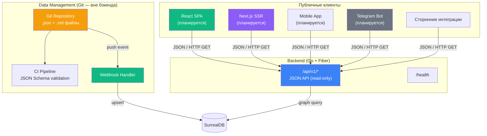
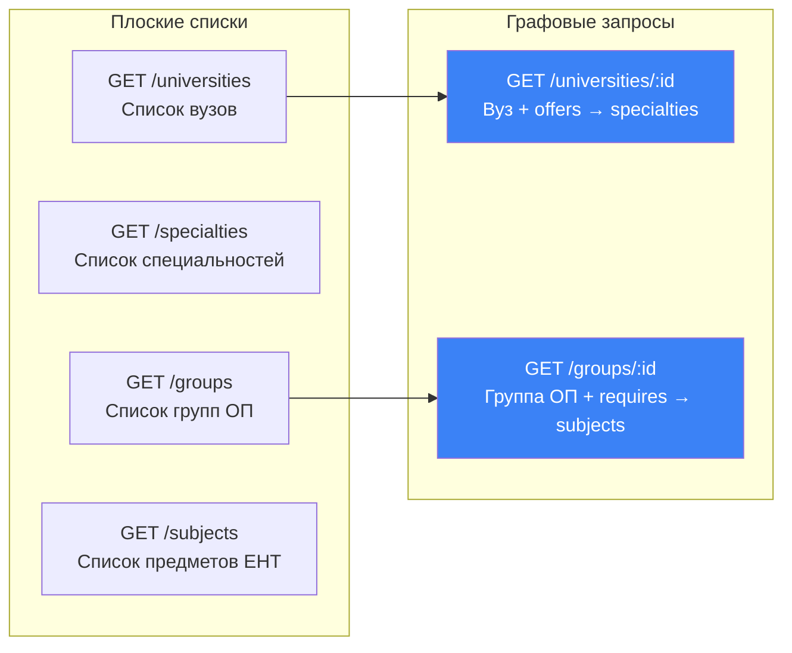
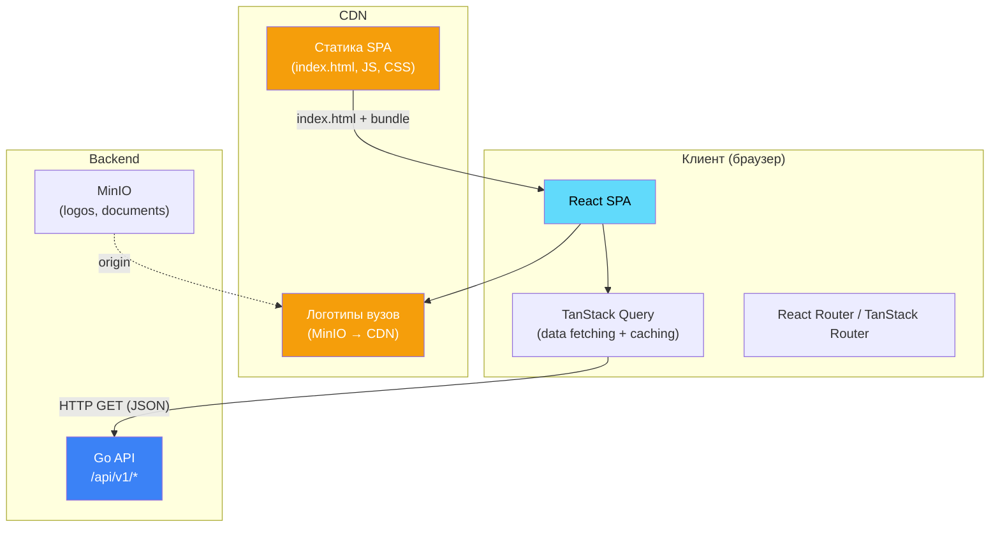
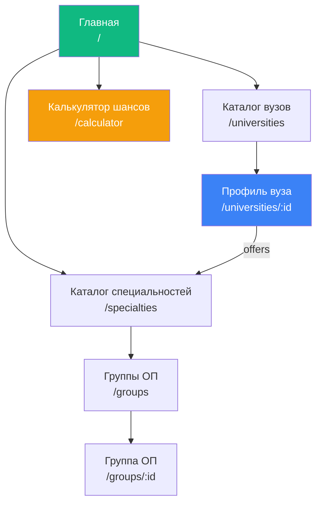
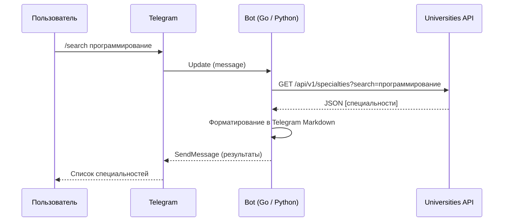

# 7. Frontend Integration Strategy

## 7.1 Единый контур потребления данных

В архитектуре v2.0 (Data-as-Code) существует **один контур** потребления данных — публичный JSON API. Контур управления данными (бывшая HTMX-админка) вынесен в Git-репозиторий и не является частью бэкенда.



**Сравнение с v1.0:**

| Аспект                | v1.0 (два контура)                              | v2.0 (один контур)                   |
| --------------------- | ----------------------------------------------- | ------------------------------------ |
| Контур управления     | HTMX-админка (SSR + cookie auth)                | Git-репозиторий (вне бэкенда)        |
| Контур потребления    | JSON API (`/api/v1/*`)                          | JSON API (`/api/v1/*`)               |
| Аутентификация        | Два режима: OAuth для админки, без auth для API | Один режим: без auth (read-only API) |
| Формат ответов        | HTML (админка) + JSON (API)                     | Только JSON                          |
| Фронтенд-зависимости  | Tailwind CSS, htmx.min.js, Node.js              | Отсутствуют                          |
| Middleware для фронта | `static`, `session`, `compress`                 | Только `compress`                    |

---

## 7.2 Публичный JSON API

### 7.2.1 Дизайн API

API построен по принципу **graph-first**: ключевые эндпоинты возвращают не плоские записи, а результаты обхода графа с развёрнутыми связями.



### 7.2.2 Таблица эндпоинтов

| Метод  | Путь                            | Описание                 | Тип запроса    | Фильтры                          |
| ------ | ------------------------------- | ------------------------ | -------------- | -------------------------------- |
| `GET`  | `/api/v1/universities`          | Список вузов             | Плоский список | `city`, `type`, `search`, `lang` |
| `GET`  | `/api/v1/universities/:id`      | Вуз + специальности      | Графовый обход | —                                |
| `POST` | `/api/v1/universities/:id/logo` | Загрузка логотипа        | Мутация        | —                                |
| `GET`  | `/api/v1/groups`                | Список групп ОП          | Плоский список | —                                |
| `GET`  | `/api/v1/groups/:id`            | Группа ОП + предметы ЕНТ | Графовый обход | —                                |
| `GET`  | `/api/v1/specialties`           | Список специальностей    | Плоский список | `search`, `lang`                 |
| `GET`  | `/api/v1/subjects`              | Список предметов ЕНТ     | Плоский список | —                                |
| `GET`  | `/health`                       | Health check             | Служебный      | —                                |

### 7.2.3 Формат ответов

**Текущий формат (v2.0):**

Ответы возвращаются без обёртки — массивы и объекты напрямую:

```/dev/null/response_list.json#L1-10
[
  {
    "id": "university:abc123",
    "name": { "kz": "Әл-Фараби атындағы ҚазҰУ", "ru": "КазНУ им. аль-Фараби", "en": "Al-Farabi KazNU" },
    "abbr": "КазНУ",
    "city": "Алматы",
    "type": "public",
    "logo_url": "http://minio:9000/logos/uuid-123.png"
  }
]
```

**Графовый ответ (детали вуза):**

```/dev/null/response_detail.json#L1-22
{
  "university": {
    "id": "university:abc123",
    "name": { "kz": "...", "ru": "КазНУ им. аль-Фараби", "en": "..." },
    "abbr": "КазНУ",
    "city": "Алматы",
    "type": "public",
    "website": "https://kaznu.kz",
    "description": "Ведущий национальный университет..."
  },
  "offers": [
    {
      "id": "offers:xyz789",
      "in": "university:abc123",
      "out": { "id": "specialty:6B06101", "code": "6B06101", "name": { "ru": "Информационные системы" } },
      "grant_count": 50,
      "quota_grant_count": 10,
      "tuition_fee": 1200000,
      "min_score": 70,
      "last_year_threshold": 118
    }
  ]
}
```

**Ошибка:**

```/dev/null/response_error.json#L1-3
{
  "error": "university not found"
}
```

### 7.2.4 Стандартизация ответов (планируемая)

Планируется обернуть все ответы в стандартный envelope:

```/dev/null/response_envelope.json#L1-15
{
  "data": [ ... ],
  "meta": {
    "total": 130,
    "limit": 50,
    "offset": 0,
    "has_more": true
  }
}
```

```/dev/null/response_envelope_error.json#L1-5
{
  "data": null,
  "error": {
    "code": "NOT_FOUND",
    "message": "university not found"
  }
}
```

| Поле          | Тип            | Описание                             |
| ------------- | -------------- | ------------------------------------ |
| `data`        | `T \| T[]`     | Результат запроса                    |
| `meta`        | `object`       | Метаданные пагинации (для коллекций) |
| `meta.total`  | `int`          | Общее количество записей             |
| `meta.limit`  | `int`          | Запрошенный лимит                    |
| `meta.offset` | `int`          | Текущее смещение                     |
| `error`       | `object\|null` | Объект ошибки (только при ошибке)    |
| `error.code`  | `string`       | Машиночитаемый код ошибки            |

---

## 7.3 React SPA (планируемый публичный фронтенд)

### 7.3.1 Архитектура интеграции



**Особенности интеграции в v2.0:**

Благодаря Data-as-Code архитектуре, интеграция с React SPA значительно упрощается по сравнению с v1.0:

| Аспект                    | v1.0                                                  | v2.0                                       |
| ------------------------- | ----------------------------------------------------- | ------------------------------------------ |
| API-эндпоинты             | Те же `/api/v1/*`                                     | Те же `/api/v1/*`                          |
| Аутентификация в API      | Нет (read-only)                                       | Нет (read-only)                            |
| CORS                      | Нужна конфигурация для admin + API                    | Только для API (один набор origins)        |
| Cookie / session conflict | Возможен конфликт admin session с API requests        | Нет cookies на бэкенде                     |
| SSR-конфликт              | Admin SSR + React SPA на одном порту = routing issues | Нет SSR на бэкенде, React на отдельном CDN |

### 7.3.2 Рекомендуемый стек React SPA

| Технология                     | Назначение                                         |
| ------------------------------ | -------------------------------------------------- |
| React 18+                      | UI-фреймворк                                       |
| TanStack Query                 | Data fetching, кэширование, stale-while-revalidate |
| TanStack Router / React Router | Клиентский роутинг                                 |
| Tailwind CSS                   | Стилизация                                         |
| TypeScript                     | Типизация (генерация типов из OpenAPI)             |
| Vite                           | Сборка и dev-сервер                                |

### 7.3.3 Ключевые страницы React SPA



| Страница               | API-эндпоинт                         | Описание                         |
| ---------------------- | ------------------------------------ | -------------------------------- |
| Каталог вузов          | `GET /api/v1/universities`           | Фильтры + поиск + пагинация      |
| Профиль вуза           | `GET /api/v1/universities/:id`       | Граф offers → specialties        |
| Каталог специальностей | `GET /api/v1/specialties`            | Поиск + пагинация                |
| Группы ОП              | `GET /api/v1/groups`                 | Список групп                     |
| Группа ОП              | `GET /api/v1/groups/:id`             | Граф requires → subjects         |
| Калькулятор шансов     | `GET /api/v1/subjects` + граф-запрос | Ввод баллов → рекомендации вузов |

### 7.3.4 Пример интеграции (TanStack Query)

```/dev/null/useUniversities.ts#L1-30
import { useQuery } from '@tanstack/react-query';

const API_BASE = import.meta.env.VITE_API_URL || 'http://localhost:3000';

interface University {
  id: string;
  name: { kz: string; ru: string; en: string };
  abbr: string;
  city: string;
  type: 'public' | 'private';
  logo_url?: string;
  website?: string;
}

async function fetchUniversities(filters?: {
  city?: string;
  type?: string;
  search?: string;
}): Promise<University[]> {
  const params = new URLSearchParams();
  if (filters?.city) params.set('city', filters.city);
  if (filters?.type) params.set('type', filters.type);
  if (filters?.search) params.set('search', filters.search);

  const res = await fetch(`${API_BASE}/api/v1/universities?${params}`);
  if (!res.ok) throw new Error('Failed to fetch universities');
  return res.json();
}

export function useUniversities(filters?: { city?: string; type?: string; search?: string }) {
  return useQuery({
    queryKey: ['universities', filters],
    queryFn: () => fetchUniversities(filters),
    staleTime: 5 * 60 * 1000, // 5 минут — данные обновляются редко (data-as-code)
  });
}
```

```/dev/null/useUniversityDetail.ts#L1-18
import { useQuery } from '@tanstack/react-query';

interface UniversityDetail {
  university: University;
  offers: Array<{
    id: string;
    out: { id: string; code: string; name: { kz: string; ru: string; en: string } };
    grant_count: number;
    quota_grant_count: number;
    tuition_fee: number;
    min_score: number;
    last_year_threshold: number;
  }>;
}

export function useUniversityDetail(id: string) {
  return useQuery({
    queryKey: ['university', id],
    queryFn: async () => {
      const res = await fetch(`${API_BASE}/api/v1/universities/${id}`);
      if (!res.ok) throw new Error('University not found');
      return res.json() as Promise<UniversityDetail>;
    },
    staleTime: 10 * 60 * 1000, // 10 минут
  });
}
```

> **Примечание:** `staleTime` можно увеличить до 30+ минут, поскольку данные обновляются только через Git → webhook pipeline, а не в реальном времени.

---

## 7.4 CORS Strategy

### 7.4.1 Текущее состояние

CORS middleware **не настроен**. Это означает:

- Запросы с другого origin (React SPA на `localhost:3001`) будут заблокированы браузером.
- API доступен напрямую (curl, Postman, серверные запросы) — CORS ограничение только на уровне браузера.

### 7.4.2 Целевая конфигурация

```/dev/null/cors_config.go#L1-16
import "github.com/gofiber/fiber/v2/middleware/cors"

// v2.0: единая CORS-конфигурация для всего API
// В v1.0 требовалась раздельная настройка для admin (deny) и API (allow)
app.Use(cors.New(cors.Config{
    AllowOrigins:     "https://app.universities.kz, http://localhost:3001",
    AllowMethods:     "GET, OPTIONS",       // Read-only API
    AllowHeaders:     "Content-Type, Accept",
    AllowCredentials: false,                 // Нет cookie-auth в v2.0
    MaxAge:           3600,                  // Preflight cache 1 час
}))

// POST /api/v1/universities/:id/logo — если сохранится,
// нужно добавить POST в AllowMethods и X-API-Key в AllowHeaders
```

**Упрощение по сравнению с v1.0:**

| Аспект            | v1.0                                     | v2.0                        |
| ----------------- | ---------------------------------------- | --------------------------- |
| CORS для `/admin` | Implicit deny (same-origin only)         | Не существует               |
| CORS для `/api`   | Whitelist origins, GET only              | Whitelist origins, GET only |
| Credentials       | `true` (для OAuth cookie)                | `false` (нет cookies)       |
| Конфликты         | Возможны при shared domain (admin + API) | Невозможны (один контур)    |

### 7.4.3 Матрица CORS по маршрутам

| Маршрут                 | CORS Allow Origin            | Методы | Credentials |
| ----------------------- | ---------------------------- | ------ | ----------- |
| `GET /api/v1/*`         | Whitelist (React SPA domain) | `GET`  | `false`     |
| `POST /api/v1/.../logo` | Whitelist (если сохранится)  | `POST` | `false`     |
| `POST /webhook/git`     | Deny (server-to-server)      | —      | —           |
| `GET /health`           | `*` (мониторинг)             | `GET`  | `false`     |

---

## 7.5 Мобильные клиенты и боты

### 7.5.1 Telegram Bot



**Ключевые команды:**

| Команда       | API-эндпоинт                         | Описание                         |
| ------------- | ------------------------------------ | -------------------------------- |
| `/search`     | `GET /api/v1/specialties?search=...` | Поиск специальностей             |
| `/university` | `GET /api/v1/universities/:id`       | Детали вуза                      |
| `/groups`     | `GET /api/v1/groups`                 | Список групп ОП                  |
| `/calculator` | Несколько запросов + логика          | Ввод предметов → подходящие вузы |

### 7.5.2 Mobile App (React Native / Flutter)

Мобильное приложение потребляет тот же `/api/v1/*` без изменений. CORS не применим к нативным HTTP-клиентам.

Рекомендации:

- Использовать те же TypeScript-типы (для React Native) или сгенерировать Dart-типы (для Flutter) из OpenAPI.
- Кэширование: `staleTime` можно увеличить до 1 часа — данные обновляются через Git, не в реальном времени.
- Offline: SQLite кэш на устройстве для работы без сети.

---

## 7.6 API Versioning Strategy

### 7.6.1 Текущий подход

API версионируется через URL-префикс:

```/dev/null/versioning.go#L1
v1 := app.Group("/api/v1")
```

### 7.6.2 Правила эволюции

| Правило                 | Описание                                            |
| ----------------------- | --------------------------------------------------- |
| **Backward compatible** | Новые поля можно добавлять в существующие ответы    |
| **No field removal**    | Поля не удаляются без создания v2                   |
| **No type changes**     | Тип существующего поля не меняется                  |
| **Deprecation window**  | 3 месяца поддержки старой версии после выхода новой |
| **Changelog**           | Изменения API документируются в `CHANGELOG.md`      |

### 7.6.3 Миграция на v2 (при необходимости)

Создание `/api/v2` потребуется при:

1. **Response envelope.** Обёртка `{data, meta, error}` ломает обратную совместимость.
2. **Rename / restructure.** Изменение структуры `offers` или `requires`.
3. **Auth для API.** Добавление API-key аутентификации.

Рекомендация: запускать v1 и v2 параллельно, пока все клиенты не мигрируют.

---

## 7.7 API Contract (будущий OpenAPI)

### 7.7.1 Рекомендация

Создать OpenAPI 3.1 спецификацию в `docs/openapi.yaml`. Это позволит:

- Генерировать TypeScript-типы для React SPA.
- Генерировать Dart-типы для Flutter.
- Автоматизировать тестирование API-контракта в CI.
- Документировать API для сторонних интеграторов.

### 7.7.2 Пример OpenAPI (фрагмент)

```/dev/null/openapi.yaml#L1-70
openapi: '3.1.0'
info:
  title: Universities KZ API
  description: |
    Публичный API агрегатора данных о вузах Казахстана.
    Данные управляются через Data-as-Code (Git + JSON/MD).
    API предоставляет read-only доступ к графовой базе данных.
  version: '1.0.0'
  license:
    name: MIT

servers:
  - url: http://localhost:3000
    description: Development
  - url: https://api.universities.kz
    description: Production

paths:
  /api/v1/universities:
    get:
      summary: Список вузов
      description: Возвращает список вузов с фильтрацией и полнотекстовым поиском.
      parameters:
        - name: city
          in: query
          schema: { type: string }
          description: Фильтр по городу (точное совпадение)
        - name: type
          in: query
          schema: { type: string, enum: [public, private] }
        - name: search
          in: query
          schema: { type: string }
          description: Полнотекстовый поиск (BM25)
        - name: lang
          in: query
          schema: { type: string, enum: [kz, ru, en], default: ru }
        - name: limit
          in: query
          schema: { type: integer, default: 50, maximum: 100 }
        - name: offset
          in: query
          schema: { type: integer, default: 0 }
      responses:
        '200':
          description: Список вузов
          content:
            application/json:
              schema:
                type: array
                items:
                  $ref: '#/components/schemas/University'

  /api/v1/universities/{id}:
    get:
      summary: Детали вуза с графовым обходом
      description: |
        Возвращает вуз вместе со списком предлагаемых специальностей
        (графовый обход через edge-таблицу offers с FETCH out).
      parameters:
        - name: id
          in: path
          required: true
          schema: { type: string }
      responses:
        '200':
          description: Детали вуза
          content:
            application/json:
              schema:
                $ref: '#/components/schemas/UniversityDetail'
        '404':
          description: Вуз не найден
```

---

## 7.8 Чек-лист готовности к React-фронтенду

| #   | Задача                                            | Статус       | Блокирует React? |
| --- | ------------------------------------------------- | ------------ | ---------------- |
| 1   | API endpoints работают и возвращают JSON          | ✅ Готово    | —                |
| 2   | CORS middleware настроен                          | 🔲 Не готово | ✅ Да            |
| 3   | Response envelope (`{data, meta}`)                | 🔲 Не готово | ❌ Нет           |
| 4   | OpenAPI спецификация                              | 🔲 Не готово | ❌ Нет           |
| 5   | TypeScript типы сгенерированы                     | 🔲 Не готово | ❌ Нет           |
| 6   | Rate limiting для API                             | 🔲 Не готово | ❌ Нет           |
| 7   | Данные по ≥ 50 вузам загружены через data-as-code | 🔲 Не готово | ✅ Да (контент)  |
| 8   | CDN для статики React SPA                         | 🔲 Не готово | ❌ Нет           |
| 9   | CDN для логотипов (MinIO → CDN)                   | 🔲 Не готово | ❌ Нет           |
| 10  | Error messages sanitized                          | 🔲 Не готово | ❌ Нет           |
| 11  | GitOps webhook pipeline работает                  | 🔲 Не готово | ✅ Да (данные)   |

**Минимально необходимо для запуска React:** пункты 1, 2, 7, 11.

---

## 7.9 Стратегия SEO

Для публичных страниц вузов важна индексация Google. Два подхода:

| Подход              | Плюсы                            | Минусы                        |
| ------------------- | -------------------------------- | ----------------------------- |
| **React SPA + SSG** | Простой деплой, быстрая загрузка | Rebuild при обновлении данных |
| **Next.js SSR/ISR** | Автоматическое обновление        | Отдельный Node.js-сервер      |

**Рекомендация:** Next.js с ISR (Incremental Static Regeneration):

- Страницы вузов генерируются статически при первом запросе.
- Ревалидация через `revalidate: 3600` (1 час) — достаточно для data-as-code pipeline.
- Не требует rebuild при каждом git push.

```/dev/null/university_page.tsx#L1-20
// pages/universities/[id].tsx (Next.js)
export async function getStaticPaths() {
  const unis = await fetch(`${API_URL}/api/v1/universities`).then(r => r.json());
  return {
    paths: unis.map((u: any) => ({
      params: { id: u.id.split(':')[1] }
    })),
    fallback: 'blocking',
  };
}

export async function getStaticProps({ params }: { params: { id: string } }) {
  const data = await fetch(`${API_URL}/api/v1/universities/${params.id}`).then(r => r.json());
  return {
    props: { university: data },
    revalidate: 3600, // 1 час — данные обновляются через git, не realtime
  };
}
```

---

_Предыдущий раздел: [← Infrastructure](./06-infrastructure.md)_
_Следующий раздел: [Roadmap →](./08-roadmap.md)_
