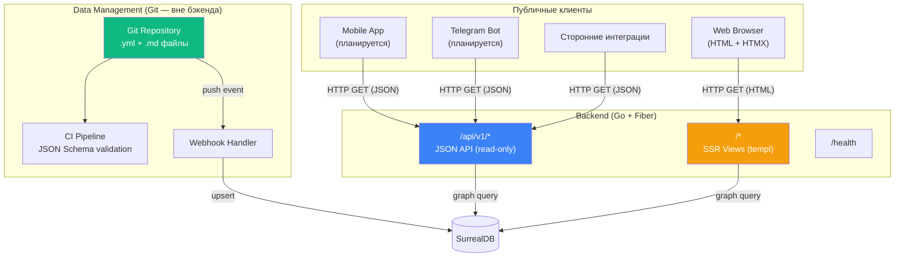

# 7. Frontend Integration Strategy

## 7.1 Контуры приложения

В архитектуре v2.0 (Data-as-Code) существует **два контура взаимодействия**:

1. **JSON API (`/api/v1/*`)**: Публичный read-only API для мобильных клиентов, Telegram-ботов и сторонних интеграций.
2. **Публичный SSR Фронтенд (`/`)**: Серверно-рендерируемый веб-интерфейс (Go templ + HTMX) для конечных пользователей (студентов, абитуриентов).

Контур управления данными (бывшая HTMX-админка) вынесен в Git-репозиторий и не является частью бэкенда.



**Сравнение с v1.0:**

| Аспект                | v1.0 (два контура)                              | v2.0 (SSR Фронтенд + JSON API)       |
| --------------------- | ----------------------------------------------- | ------------------------------------ |
| Контур управления     | HTMX-админка (SSR + cookie auth)                | Git-репозиторий (вне бэкенда)        |
| Контур потребления    | JSON API (`/api/v1/*`)                          | JSON API + Публичный SSR (HTMX)      |
| Аутентификация        | Два режима: OAuth для админки, без auth для API | Без auth (публичный доступ)          |
| Фронтенд-зависимости  | Tailwind CSS, htmx.min.js, Node.js              | Только htmx.min.js и чистый CSS      |
| Middleware для фронта | `static`, `session`, `compress`                 | `static`, `compress`                 |

---

## 7.2 Публичный JSON API

### 7.2.1 Дизайн API

API построен по принципу **graph-first**: ключевые эндпоинты возвращают не плоские записи, а результаты обхода графа с развёрнутыми связями.

### 7.2.2 Таблица эндпоинтов

| Метод  | Путь                            | Описание                 | Тип запроса    | Фильтры                          |
| ------ | ------------------------------- | ------------------------ | -------------- | -------------------------------- |
| `GET`  | `/api/v1/universities`          | Список вузов             | Плоский список | `city`, `type`, `search`, `lang` |
| `GET`  | `/api/v1/universities/:id`      | Вуз + специальности      | Графовый обход | —                                |
| `GET`  | `/api/v1/groups`                | Список групп ОП          | Плоский список | —                                |
| `GET`  | `/api/v1/groups/:id`            | Группа ОП + предметы ЕНТ | Графовый обход | —                                |
| `GET`  | `/api/v1/specialties`           | Список специальностей    | Плоский список | `search`, `lang`                 |
| `GET`  | `/api/v1/subjects`              | Список предметов ЕНТ     | Плоский список | —                                |
| `GET`  | `/health`                       | Health check             | Служебный      | —                                |

---

## 7.3 Публичный SSR-фронтенд (Go templ + HTMX)

### 7.3.1 Архитектура интеграции

Вместо SPA (React/Next.js) выбран максимально лёгкий подход: **Серверный рендеринг (SSR)** на базе `github.com/a-h/templ` с применением **HTMX** для интерактивности.

**Преимущества:**
- **Zero JS Build:** Нет Node.js, Webpack, Vite. Весь HTML генерируется бинарником Go.
- **Типизация:** `templ` компилируется в Go, исключая ошибки в шаблонах на этапе компиляции.
- **Один процесс:** API и веб-интерфейс обслуживаются одним процессом Fiber (на разных роутах), что упрощает деплой и избавляет от проблем с CORS.
- **SEO из коробки:** Полный HTML отдаётся сразу, что идеально для поисковых роботов без необходимости сложного ISR/SSG сетапа.
- **Кастомный дизайн:** Отказ от Tailwind в пользу чистого CSS (`static/css/main.css`) позволяет индивидуально стилизовать страницы каждого университета.

### 7.3.2 Ключевые страницы SSR

| Страница               | Роут                             | Описание                         |
| ---------------------- | -------------------------------- | -------------------------------- |
| Главная                | `GET /`                          | Лендинг и навигация              |
| Каталог вузов          | `GET /universities`              | Фильтры + поиск + HTMX пагинация |
| Профиль вуза           | `GET /universities/:id`          | Граф offers → specialties        |
| Каталог специальностей | `GET /specialties`               | Поиск + HTMX пагинация           |
| Группы ОП              | `GET /groups`                    | Список групп                     |
| Группа ОП              | `GET /groups/:id`                | Граф requires → subjects         |
| Калькулятор шансов     | `GET /calculator`                | Ввод баллов → рекомендации вузов |

---

## 7.4 CORS Strategy

Так как публичный веб-интерфейс теперь отдается самим бэкендом (один и тот же origin), настройка CORS требуется **исключительно** для сторонних API-клиентов.

```go
app.Use(cors.New(cors.Config{
    AllowOrigins:     "*", // Read-only публичный API
    AllowMethods:     "GET, OPTIONS",
    AllowHeaders:     "Content-Type, Accept",
    AllowCredentials: false,
    MaxAge:           3600,
}))
```

---

## 7.5 Мобильные клиенты и боты

### 7.5.1 Telegram Bot

Используют JSON API напрямую. Никаких изменений.

### 7.5.2 Mobile App (React Native / Flutter)

Мобильное приложение потребляет `/api/v1/*`. CORS не применим.

---

## 7.6 API Contract (будущий OpenAPI)

Создание OpenAPI 3.1 спецификации в `docs/swagger` или `docs/openapi.yaml` остается актуальным для:
- Документирования API для сторонних интеграторов.
- Автоматизации тестирования API-контракта в CI.

---

## 7.7 Стратегия SEO

SSR полностью закрывает вопрос SEO. Никаких дополнительных инструментов (типа Next.js) не требуется. Поисковые боты получают полноценный HTML при запросе любой страницы (например, `/universities/abc123`).

_Предыдущий раздел: [← Infrastructure](./06-infrastructure.md)_
_Следующий раздел: [Roadmap →](./08-roadmap.md)_
