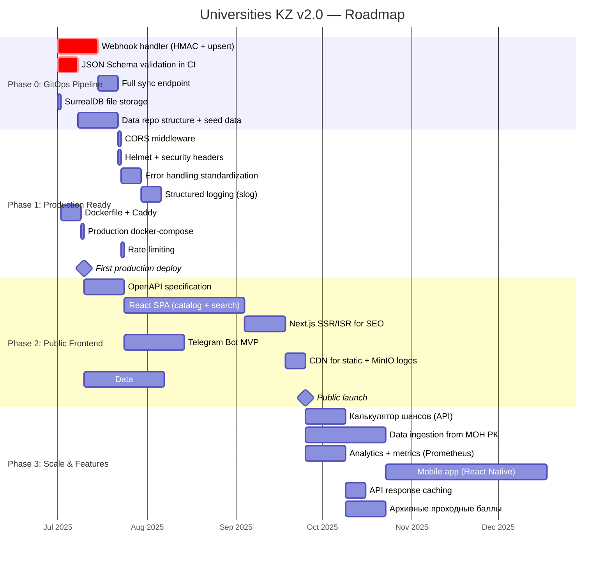
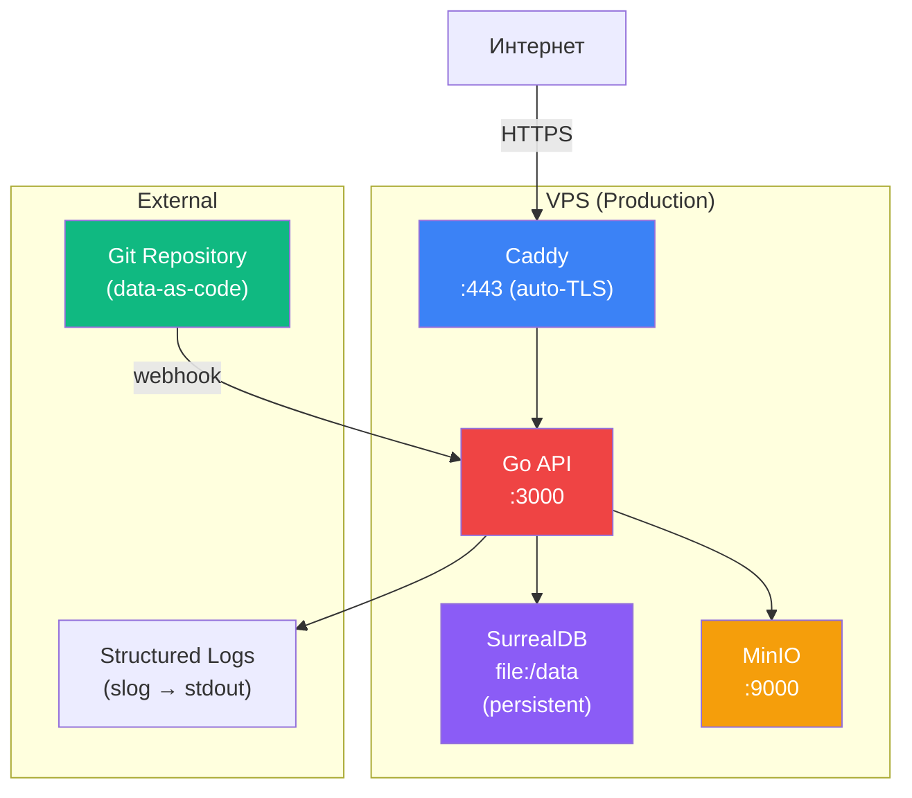
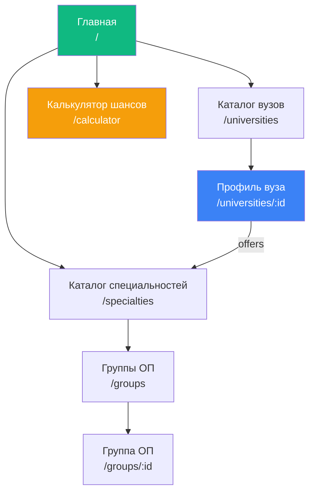
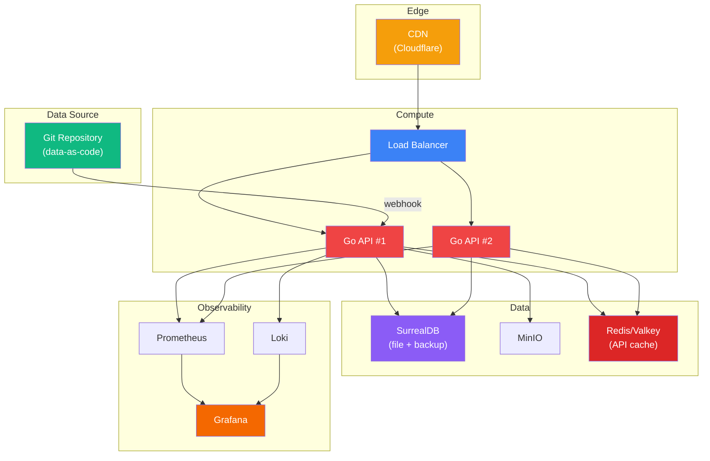
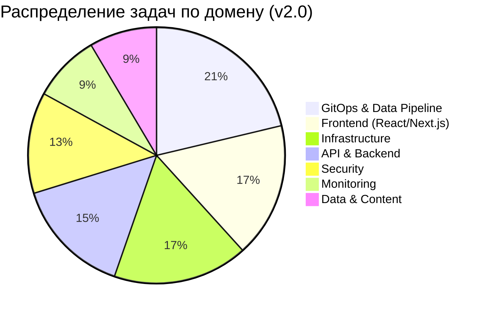

# 8. Roadmap & Action Items

## 8.1 Общая стратегия развития

Universities KZ v2.0 развивается в четыре фазы. Переход на Data-as-Code архитектуру существенно изменил приоритеты: вместо security hardening для веб-админки (Phase 0 в v1.0) первая фаза теперь посвящена **GitOps pipeline** — механизму синхронизации данных из Git в SurrealDB.



---

## 8.2 Phase 0: GitOps Pipeline (P0)

> **Цель:** Реализовать полный цикл Data-as-Code: Git → CI validation → webhook → SurrealDB. Без этой фазы данные невозможно загружать в БД автоматически.
>
> **Сроки:** 2–3 недели
>
> **Блокирует:** Все последующие фазы (нет данных = нет API = нет фронтенда)

### 8.2.1 Задачи

| #    | Задача                                  | Файлы для изменения / создания                              | Оценка  | Приоритет | Статус |
| ---- | --------------------------------------- | ----------------------------------------------------------- | ------- | --------- | ------ |
| 0.1  | **Webhook handler (POST /webhook/git)** | Новый файл `internal/webhook/handler.go`, `cmd/api/main.go` | 2–3 дня | 🔴 P0     | 🔲     |
| 0.2  | **HMAC-SHA256 верификация подписи**     | `internal/webhook/verify.go`                                | 2 часа  | 🔴 P0     | 🔲     |
| 0.3  | **JSON Schema для university.json**     | `schemas/university.schema.json`                            | 3 часа  | 🔴 P0     | 🔲     |
| 0.4  | **JSON Schema для specialty.json**      | `schemas/specialty.schema.json`                             | 2 часа  | 🔴 P0     | 🔲     |
| 0.5  | **JSON Schema для group.json**          | `schemas/specialty_group.schema.json`                       | 2 часа  | 🔴 P0     | 🔲     |
| 0.6  | **CI: JSON Schema validation**          | `.github/workflows/data-validate.yml` (в data-репозитории)  | 2 часа  | 🔴 P0     | 🔲     |
| 0.7  | **Full sync endpoint**                  | `internal/webhook/sync.go`                                  | 1 день  | 🟡 P0     | 🔲     |
| 0.8  | **SurrealDB: memory → file:**           | `docker-compose.yml`                                        | 15 мин  | 🔴 P0     | 🔲     |
| 0.9  | **Seed data: 5–10 вузов в Git**         | Отдельный data-репозиторий                                  | 2–3 дня | 🔴 P0     | 🔲     |
| 0.10 | **Logo upload: убрать или защитить**    | `cmd/api/main.go`                                           | 30 мин  | 🟡 P0     | 🔲     |
| 0.11 | **Удалить артефакты v1.0**              | `package.json`, `tailwind.config.js`, `package-lock.json`   | 10 мин  | 🟢 P0     | 🔲     |

### 8.2.2 Детали реализации

**0.1 — Webhook handler:**

```/dev/null/webhook_handler.go#L1-35
// POST /webhook/git — приём push-событий от GitHub/GitLab
func webhookHandler(repos WebhookRepos, secret string) fiber.Handler {
    return func(c *fiber.Ctx) error {
        // 1. Верификация HMAC-SHA256
        if !verifySignature(c.Body(), c.Get("X-Hub-Signature-256"), secret) {
            return c.Status(403).JSON(fiber.Map{"error": "invalid signature"})
        }

        // 2. Парсинг push event → список изменённых файлов
        event, err := parsePushEvent(c.Body())
        if err != nil {
            return c.Status(400).JSON(fiber.Map{"error": "invalid payload"})
        }

        // 3. Для каждого файла: fetch content → validate → upsert/delete
        results := syncChangedFiles(c.Context(), event, repos)

        return c.JSON(fiber.Map{
            "processed": results.Total,
            "success":   results.Success,
            "errors":    results.Errors,
        })
    }
}
```

**0.7 — Full sync endpoint:**

```/dev/null/full_sync.go#L1-20
// POST /webhook/sync — полная синхронизация всех данных из Git
// Используется при первом деплое или после потери БД
func fullSyncHandler(repos WebhookRepos, gitClient GitClient) fiber.Handler {
    return func(c *fiber.Ctx) error {
        // 1. Проверка API-key
        if c.Get("X-API-Key") != os.Getenv("WEBHOOK_SECRET") {
            return c.Status(403).JSON(fiber.Map{"error": "unauthorized"})
        }

        // 2. Fetch все файлы из data-репозитория
        files, err := gitClient.ListAllDataFiles(c.Context())
        if err != nil {
            return c.Status(500).JSON(fiber.Map{"error": "failed to list files"})
        }

        // 3. Синхронизация каждого файла
        results := syncAllFiles(c.Context(), files, repos)
        return c.JSON(results)
    }
}
```

**0.8 — SurrealDB persistent storage:**

```/dev/null/docker-compose-fix.yml#L1-8
surrealdb:
    image: surrealdb/surrealdb:latest
    container_name: universities_db
    ports:
      - "8000:8000"
    command: start --log info --user ${SURREAL_USER} --pass ${SURREAL_PASS} file:/data/surreal.db
    volumes:
      - surreal_data:/data
    restart: always
```

**0.11 — Удалить артефакты v1.0:**

Следующие файлы являются остатками HTMX-админки и не используются в v2.0:

| Файл                 | Назначение в v1.0             | Действие                                     |
| -------------------- | ----------------------------- | -------------------------------------------- |
| `package.json`       | npm-зависимость (Tailwind)    | ❌ Удалить                                   |
| `package-lock.json`  | npm lock-file                 | ❌ Удалить                                   |
| `tailwind.config.js` | Конфигурация Tailwind CSS     | ❌ Удалить                                   |
| `.air.toml`          | Hot reload (Tailwind + views) | ✏️ Упростить (убрать pre_cmd, views, static) |

### 8.2.3 Структура data-репозитория (целевая)

```
universities-data/                  # Отдельный Git-репозиторий
├── .github/
│   └── workflows/
│       └── validate.yml           # JSON Schema validation на каждый PR
├── schemas/
│   ├── university.schema.json
│   ├── specialty.schema.json
│   └── specialty_group.schema.json
├── data/
│   ├── universities/
│   │   ├── kaznu.json
│   │   ├── kaznu.md               # Markdown-описание вуза
│   │   ├── sdu.json
│   │   ├── sdu.md
│   │   └── ...
│   ├── specialties/
│   │   ├── 6B06101.json
│   │   └── ...
│   ├── groups/
│   │   ├── B057.json
│   │   └── ...
│   └── subjects/
│       ├── math.json
│       ├── physics.json
│       └── ...
└── README.md
```

### 8.2.4 Критерии завершения Phase 0

- [ ] Webhook handler принимает push-события и синхронизирует данные в SurrealDB
- [ ] HMAC-SHA256 верификация подписи работает (поддельные запросы отклоняются)
- [ ] JSON Schema валидация в CI data-репозитория (невалидные PR не мержатся)
- [ ] Full sync endpoint восстанавливает БД из Git за < 1 минуту
- [ ] SurrealDB работает с `file:` storage (данные сохраняются между перезапусками)
- [ ] 5–10 вузов загружены через data-as-code pipeline
- [ ] API возвращает загруженные данные через `/api/v1/universities`
- [ ] Артефакты v1.0 (package.json, tailwind.config.js) удалены или помечены для удаления

---

## 8.3 Phase 1: Production Ready (P1)

> **Цель:** Довести систему до состояния, пригодного для первого production-деплоя. API доступен через HTTPS, ошибки логируются, данные бэкапятся.
>
> **Сроки:** 2–3 недели после Phase 0
>
> **Зависит от:** Phase 0

### 8.3.1 Задачи

| #    | Задача                             | Описание                                                       | Оценка  | Статус |
| ---- | ---------------------------------- | -------------------------------------------------------------- | ------- | ------ |
| 1.1  | **CORS middleware**                | `fiber/middleware/cors` с whitelist origins для React SPA      | 1 час   | 🔲     |
| 1.2  | **Helmet (security headers)**      | CSP, X-Frame-Options, X-Content-Type-Options                   | 15 мин  | 🔲     |
| 1.3  | **Rate limiting**                  | `fiber/middleware/limiter` для `/api/v1/*` и `/webhook/*`      | 1 час   | 🔲     |
| 1.4  | **Error handling standardization** | Generic сообщения клиенту, детальное логирование на сервер     | 1 день  | 🔲     |
| 1.5  | **Structured logging**             | Перейти на `slog` (Go stdlib): JSON-формат, levels, request_id | 1–2 дня | 🔲     |
| 1.6  | **Dockerfile**                     | Multi-stage build (Go → Alpine), `go:embed` для schema.surql   | 2 часа  | 🔲     |
| 1.7  | **Caddy reverse proxy**            | Caddyfile с auto-TLS + proxy на Go API                         | 1 час   | 🔲     |
| 1.8  | **Production docker-compose**      | `docker-compose.prod.yml`: app + surrealdb + minio + caddy     | 2 часа  | 🔲     |
| 1.9  | **Backup скрипты**                 | `surreal export` + `mc mirror` в cron                          | 2 часа  | 🔲     |
| 1.10 | **SurrealDB PERMISSIONS**          | `FULL` → `FOR select FULL, FOR create/update/delete NONE`      | 1 час   | 🔲     |
| 1.11 | **`.env.example`**                 | Документированный пример переменных окружения                  | 15 мин  | 🔲     |

### 8.3.2 Архитектура после Phase 1



### 8.3.3 Критерии завершения Phase 1

- [ ] Система доступна по HTTPS на домене
- [ ] CORS настроен для будущего React SPA
- [ ] Security headers присутствуют в HTTP-ответах
- [ ] Rate limiting активен для API и webhook
- [ ] Ошибки логируются в structured JSON (не утекают клиенту)
- [ ] Ежедневный бэкап SurrealDB + MinIO
- [ ] CI pipeline проходит: build → test → lint → docker validate
- [ ] `GET /health` возвращает `200 OK`
- [ ] SurrealDB PERMISSIONS: deny-by-default для записи

---

## 8.4 Phase 2: Public Frontend (P2)

> **Цель:** Запустить публичный интерфейс для абитуриентов — React SPA (или Next.js для SEO) + Telegram-бот. Данные доступны 150 000+ пользователям.
>
> **Сроки:** 2–3 месяца после Phase 1
>
> **Зависит от:** Phase 1 (CORS, production deploy)

### 8.4.1 Задачи

| #    | Задача                                | Описание                                         | Оценка     | Статус |
| ---- | ------------------------------------- | ------------------------------------------------ | ---------- | ------ |
| 2.1  | **OpenAPI-спецификация**              | `docs/openapi.yaml` для `/api/v1/*`              | 2–3 дня    | 🔲     |
| 2.2  | **TypeScript-типы из OpenAPI**        | Генерация типов для React SPA                    | 1 день     | 🔲     |
| 2.3  | **React SPA: каталог вузов**          | Список + фильтры + поиск + пагинация             | 2 недели   | 🔲     |
| 2.4  | **React SPA: профиль вуза**           | Детали + специальности + offers (графовый обход) | 1 неделя   | 🔲     |
| 2.5  | **React SPA: каталог специальностей** | Список + поиск + связанные группы ОП             | 1 неделя   | 🔲     |
| 2.6  | **React SPA: калькулятор шансов**     | Ввод баллов → рекомендации вузов                 | 2 недели   | 🔲     |
| 2.7  | **i18n (3 языка)**                    | kz, ru, en в React SPA                           | 1 неделя   | 🔲     |
| 2.8  | **Next.js SSR/ISR для SEO**           | SSG/ISR для страниц вузов (индексация Google)    | 2 недели   | 🔲     |
| 2.9  | **CDN**                               | Cloudflare / Bunny для статики и логотипов       | 1 день     | 🔲     |
| 2.10 | **Telegram Bot MVP**                  | `/search`, `/university`, `/calculator`          | 2–3 недели | 🔲     |
| 2.11 | **API response envelope**             | `{data, meta}` обёртка для пагинации             | 1 день     | 🔲     |
| 2.12 | **Integration tests**                 | API contract validation в CI                     | 2–3 дня    | 🔲     |
| 2.13 | **Data: 50+ вузов**                   | Наполнение data-репозитория через Git            | 4 недели   | 🔲     |

### 8.4.2 React SPA — ключевые страницы



### 8.4.3 Данные для наполнения (Data-as-Code workflow)

| Источник        | Тип данных                   | Метод получения                    | Объём                            |
| --------------- | ---------------------------- | ---------------------------------- | -------------------------------- |
| МОН РК (gov.kz) | Проходные баллы, гранты      | Парсинг PDF → JSON → git commit    | ~130 вузов × ~300 специальностей |
| Сайты вузов     | Стоимость обучения, описания | Ручной ввод → JSON/MD → git commit | ~130 вузов                       |
| ЕНТ (egov.kz)   | Предметы, пороговые баллы    | Парсинг → JSON → git commit        | ~20 предметов                    |
| Рейтинги        | QS, THE, национальные        | Ручной ввод → JSON → git commit    | ~50 вузов                        |

**Преимущество Data-as-Code:** каждый источник данных можно оформить как отдельный PR с указанием источника в `sources` поле JSON-файла. Review → merge → webhook → данные в API.

### 8.4.4 Критерии завершения Phase 2

- [ ] React SPA (или Next.js) доступен на публичном домене
- [ ] Абитуриент может найти вуз по городу, типу, названию
- [ ] Абитуриент может увидеть специальности вуза с баллами и стоимостью
- [ ] Калькулятор шансов работает (ввод баллов → список вузов)
- [ ] Telegram Bot отвечает на базовые запросы
- [ ] SEO: страницы вузов индексируются Google
- [ ] Данные по ≥ 50 вузам загружены через data-as-code pipeline и верифицированы

---

## 8.5 Phase 3: Scale & Features (P3)

> **Цель:** Масштабирование, продвинутые фичи, аналитика. Система обслуживает пиковые нагрузки июля–августа.
>
> **Сроки:** 3–6 месяцев после Phase 2
>
> **Зависит от:** Phase 2

### 8.5.1 Задачи

| #    | Задача                        | Описание                                                     | Оценка     | Статус |
| ---- | ----------------------------- | ------------------------------------------------------------ | ---------- | ------ |
| 3.1  | **Калькулятор шансов (API)**  | Эндпоинт: два предмета ЕНТ + балл → подходящие вузы (граф)   | 1 неделя   | 🔲     |
| 3.2  | **Response caching**          | `fiber/middleware/cache` для read-only API                   | 1 день     | 🔲     |
| 3.3  | **Prometheus metrics**        | `http_requests_total`, `http_request_duration_seconds`, etc. | 2–3 дня    | 🔲     |
| 3.4  | **Grafana dashboards**        | Визуализация метрик: RPS, latency, errors                    | 1–2 дня    | 🔲     |
| 3.5  | **Data ingestion pipeline**   | Автоматический парсинг данных МОН РК → JSON → git commit     | 2–4 недели | 🔲     |
| 3.6  | **Mobile app**                | React Native / Flutter                                       | 2 месяца   | 🔲     |
| 3.7  | **Архивные данные**           | Проходные баллы за прошлые годы (история, тренды)            | 1–2 недели | 🔲     |
| 3.8  | **Сравнение вузов**           | API-эндпоинт: сравнение 2–3 вузов по параметрам              | 1 неделя   | 🔲     |
| 3.9  | **Уведомления**               | Push/email при изменении проходных баллов                    | 2–3 недели | 🔲     |
| 3.10 | **Data validation dashboard** | Web-интерфейс для мониторинга качества данных в Git          | 1 неделя   | 🔲     |
| 3.11 | **Contributor guide**         | Документация для внешних контрибьюторов data-репозитория     | 2–3 дня    | 🔲     |
| 3.12 | **API v2**                    | Response envelope, cursor pagination, стандартизация ошибок  | 2 недели   | 🔲     |

### 8.5.2 Архитектура масштабирования



---

## 8.6 Сводная матрица приоритетов

### По критичности

| Приоритет | Кол-во задач | Описание                             | Когда       |
| --------- | ------------ | ------------------------------------ | ----------- |
| 🔴 **P0** | 11           | GitOps pipeline — данные в систему   | Немедленно  |
| 🟠 **P1** | 11           | Production readiness — первый деплой | 2–3 недели  |
| 🟡 **P2** | 13           | Public frontend + data ingestion     | 2–3 месяца  |
| 🟢 **P3** | 12           | Scale, features, polish              | 3–6 месяцев |

### По домену



| Домен                      | P0  | P1  | P2  | P3  | Итого |
| -------------------------- | --- | --- | --- | --- | ----- |
| **GitOps & Data Pipeline** | 7   | 0   | 1   | 2   | 10    |
| **Frontend (React/Next)**  | 0   | 0   | 7   | 1   | 8     |
| **Infrastructure**         | 1   | 5   | 1   | 1   | 8     |
| **API & Backend**          | 1   | 2   | 2   | 2   | 7     |
| **Security**               | 2   | 3   | 0   | 1   | 6     |
| **Data & Content**         | 1   | 0   | 1   | 2   | 4     |
| **Monitoring**             | 0   | 1   | 0   | 3   | 4     |

**Ключевой сдвиг по сравнению с v1.0:** в v1.0 доминировал домен Security (10 задач), потому что веб-админка создавала множество векторов атаки. В v2.0 Security сократился до 6 задач, а лидер — **GitOps & Data Pipeline** (10 задач) — ядро новой архитектуры.

---

## 8.7 Технический долг

### 8.7.1 Текущий технический долг

| #     | Долг                                        | Влияние        | Сложность | Фаза    |
| ----- | ------------------------------------------- | -------------- | --------- | ------- |
| TD-1  | **SurrealDB in-memory**                     | 🔴 Критическое | Низкая    | Phase 0 |
| TD-2  | **PERMISSIONS FULL** на всех таблицах       | 🟡 Среднее     | Средняя   | Phase 1 |
| TD-3  | **Inline API handlers** в `main.go`         | 🟡 Среднее     | Средняя   | Phase 2 |
| TD-4  | **Неструктурированное логирование**         | 🟡 Среднее     | Средняя   | Phase 1 |
| TD-5  | **Ошибки утекают клиенту** (`err.Error()`)  | 🟡 Среднее     | Низкая    | Phase 1 |
| TD-6  | **Артефакты v1.0** (package.json, tailwind) | 🟢 Низкое      | Низкая    | Phase 0 |
| TD-7  | **Нет Dockerfile**                          | 🟠 Высокое     | Низкая    | Phase 1 |
| TD-8  | **`goth` в go.mod** (не используется)       | 🟢 Низкое      | Низкая    | Phase 0 |
| TD-9  | **`configs/` директория пуста**             | 🟢 Низкое      | Низкая    | Phase 1 |
| TD-10 | **Logo upload без аутентификации**          | 🟡 Среднее     | Низкая    | Phase 0 |

### 8.7.2 Устранённый долг (v1.0 → v2.0)

Следующий технический долг из v1.0 был **полностью устранён** переходом на Data-as-Code:

| Долг v1.0                                | Как устранён                |
| ---------------------------------------- | --------------------------- |
| CSRF-защита для admin endpoints          | Нет admin endpoints         |
| `safeHTML` в template FuncMap (XSS risk) | Нет шаблонов                |
| CSS sanitizer не блокирует `position:`   | Нет CSS injection (нет SSR) |
| `CookieSecure: false`                    | Нет cookies                 |
| README Roadmap устарел (offers/requires) | Roadmap переписан           |
| Inline business logic в admin handlers   | Нет admin handlers          |
| Session store не подписывает cookie      | Нет sessions                |

### 8.7.3 Правила управления долгом

1. **Каждый PR** должен закрывать хотя бы один пункт tech debt (если есть P0/P1).
2. **Новый долг** документируется в этом файле с датой и обоснованием.
3. **Ежемесячный review** — пересмотр приоритетов и оценок.
4. **Долг не блокирует фичи** (кроме P0), но отслеживается.

---

## 8.8 Risks & Mitigations

| #   | Риск                                                        | Вероятность | Влияние    | Митигация                                                                                                |
| --- | ----------------------------------------------------------- | ----------- | ---------- | -------------------------------------------------------------------------------------------------------- |
| R-1 | **SurrealDB breaking changes** — молодая БД, API нестабилен | Средняя     | 🔴 Высокое | Repository-интерфейсы изолируют код от БД. Зафиксировать версию в docker-compose.                        |
| R-2 | **Пиковая нагрузка в июле–августе**                         | Высокая     | 🟡 Среднее | Go + Fiber выдерживают 50K+ RPS. CDN + caching для read-only API. БД восстановима из Git.                |
| R-3 | **Неактуальные данные** — ручной ввод не успевает           | Высокая     | 🔴 Высокое | Автоматизация парсинга МОН РК (Phase 3). Community contributions через PR в data-репозиторий.            |
| R-4 | **Единая точка отказа** — один VPS                          | Средняя     | 🟡 Среднее | БД восстановима из Git (full sync < 1 мин). Daily backups. Documented recovery procedure (RTO < 15 min). |
| R-5 | **Bus factor = 1**                                          | Высокая     | 🔴 Высокое | Этот System Design Document. Data-as-Code: данные в Git, не в голове инженера.                           |
| R-6 | **Webhook spoofing**                                        | Средняя     | 🟡 Среднее | HMAC-SHA256 верификация + IP whitelist + JSON Schema validation.                                         |
| R-7 | **Git repository corruption**                               | Низкая      | 🔴 Высокое | GitHub/GitLab обеспечивают redundancy. Локальные клоны у нескольких контрибьюторов.                      |
| R-8 | **Data quality issues** — ошибки в JSON-файлах              | Средняя     | 🟡 Среднее | JSON Schema validation в CI. Обязательный PR review. ASSERT-ы в SurrealDB.                               |

**Новые риски v2.0 по сравнению с v1.0:**

- **R-6 (webhook spoofing)** — появился с GitOps pipeline. Митигация: HMAC + IP whitelist.
- **R-7 (Git corruption)** — данные теперь зависят от Git-хостинга. Митигация: Git intrinsically distributed.
- **R-8 (data quality)** — ручной ввод JSON менее удобен, чем формы. Митигация: JSON Schema + CI + PR review.

**Устранённые риски v1.0:**

- ~~R-6 (CORS misconfiguration при запуске React)~~ → упрощено: нет admin CORS, только API.
- ~~Риск CSRF/session/OAuth~~ → устранены архитектурно.

---

## 8.9 Definition of Done (DoD)

Каждая задача считается завершённой, если:

| Критерий          | Описание                                                       |
| ----------------- | -------------------------------------------------------------- |
| **Code**          | Код написан, code review пройден                               |
| **Tests**         | Unit/integration тесты написаны и проходят                     |
| **CI**            | Pipeline зелёный (build + test + lint)                         |
| **Docs**          | System Design Document обновлён (если архитектурное изменение) |
| **README**        | README обновлён (если новый endpoint / env / dependency)       |
| **Security**      | Нет новых уязвимостей в webhook / API                          |
| **Data CI**       | JSON Schema валидация проходит (для data-репозитория)          |
| **No regression** | Существующая функциональность не сломана                       |

---

## 8.10 Quick Wins (можно сделать за 1 день)

Задачи, которые дают максимальную отдачу при минимальных затратах:

| #    | Задача                                                            | Время  | Эффект                                             |
| ---- | ----------------------------------------------------------------- | ------ | -------------------------------------------------- |
| QW-1 | SurrealDB `memory` → `file:` + volume                             | 15 мин | Данные не теряются при рестарте                    |
| QW-2 | Удалить `package.json`, `tailwind.config.js`, `package-lock.json` | 5 мин  | Убирает путаницу (v1.0 артефакты)                  |
| QW-3 | Упростить `.air.toml` (убрать Tailwind pre_cmd, views, static)    | 15 мин | Air не пытается собирать несуществующие файлы      |
| QW-4 | Удалить `goth` из `go.mod` (`go mod tidy`)                        | 1 мин  | Чистка неиспользуемых зависимостей                 |
| QW-5 | Добавить `.env.example`                                           | 15 мин | Упрощает onboarding                                |
| QW-6 | Создать пустой data-репозиторий со структурой каталогов           | 30 мин | Основа для data-as-code                            |
| QW-7 | Добавить `helmet` middleware                                      | 15 мин | 6 security headers одной строкой                   |
| QW-8 | Убрать / защитить `POST /api/v1/universities/:id/logo`            | 15 мин | Устраняет единственный неаутентифицированный write |

**Суммарно:** ~2 часа работы закрывают 3 tech debt + 1 security issue + 2 cleanup.

---

_Предыдущий раздел: [← Frontend Integration Strategy](./07-frontend-integration.md)_
_Вернуться к оглавлению: [← Index](./00-index.md)_
